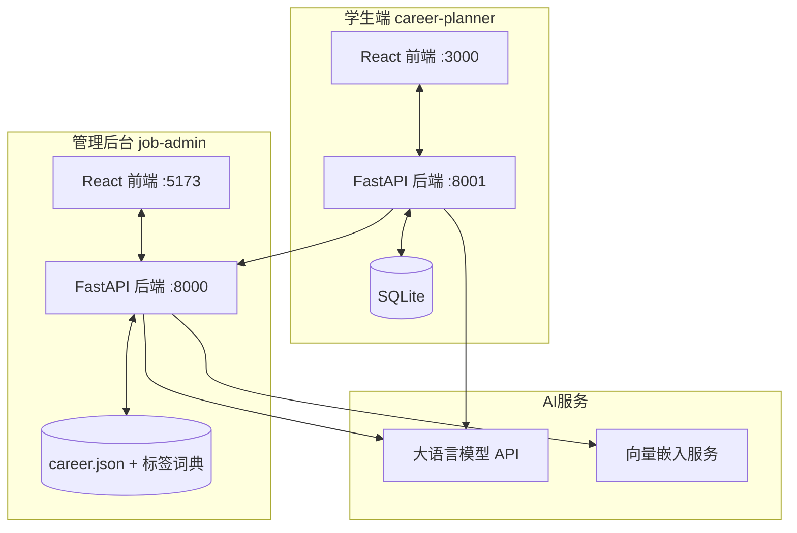

# AI Job Match — 智能人岗匹配系统

<p align="center">
  
</p>

<p align="center">
  <a href="./README_EN.md">English</a>
</p>

<p align="center">
  <a href="https://www.bilibili.com/video/BV1HwEi6pECu" target="_blank">
    
  </a>
  &nbsp;&nbsp;
  <a href="https://ztx.6767.chat" target="_blank">
    
  </a>
</p>

<p align="center">
  
  
  
  
  
  
</p>

---

## 项目简介

一个基于大语言模型的人岗匹配系统，包含学生端和管理后台两个客户端。

学生端支持简历上传、能力画像构建、技能标签管理，以及智能岗位匹配推荐。管理后台负责岗位数据的录入、JD 结构化提取、标签归一化治理，以及匹配引擎的管理。

系统的核心思路是：先把学生和岗位的能力分别拆解为结构化标签（技术栈、技术能力、开发工具、软素质、成长潜力五个维度），再通过逐标签对齐、等级差计算和加权打分完成匹配，最终输出可解释的匹配结果和差距分析。

---

## 截图预览

> 截图待补充。启动服务后将关键页面截图放到 `docs/screenshots/` 目录下。

<!--
<p align="center">
  
  &nbsp;&nbsp;
  
</p>
<p align="center">
  
  &nbsp;&nbsp;
  
</p>
-->

---

## 系统架构

系统分为两个独立的前后端应用，共享一份岗位数据集和标签词典：



- 学生端后端调用管理后台的匹配接口获取推荐结果
- 管理后台负责维护岗位库、标签索引和向量缓存
- 所有 LLM 调用通过 OpenAI 兼容接口，支持多家模型供应商

---

## 技术栈

| 层次 | 技术 | 说明 |
|---|---|---|
| 前端 | React 19 + Vite + Tailwind CSS | 两个独立的单页应用 |
| 后端 | FastAPI + Uvicorn | 学生端 :8001，管理后台 :8000 |
| 数据库 | SQLite（学生端）、JSON 文件（岗位库） | 轻量部署，无需额外数据库服务 |
| AI 模型 | OpenAI 兼容 API（旗舰 + 快速 + 向量三层） | 支持 GPT / Claude / DeepSeek 等 |
| 向量服务 | 智谱 Embedding-3（2048 维） | 标签语义搜索和归一化 |
| 数据处理 | NumPy + Pandas + Scikit-learn | 匹配打分和向量计算 |

---

## 快速启动

### 环境要求

- Python 3.10+
- Node.js 18+

### 安装依赖

```bash
pip install -r requirements.txt

cd career-planner/frontend && npm install && cd ../..
cd job-admin/frontend && npm install && cd ../..
```

### 配置环境变量

复制 `.env.example` 为 `.env`，填入模型 API 密钥：

```ini
# 旗舰模型（简历解析、报告生成、岗位画像提取）
JOB_SYSTEM_FLAGSHIP_LLM_BASE_URL=https://api.example.com/v1
JOB_SYSTEM_FLAGSHIP_LLM_API_KEY=your-key
JOB_SYSTEM_FLAGSHIP_LLM_MODEL=gpt-5.4

# 快速模型（分类、判断等轻量任务）
JOB_SYSTEM_FAST_LLM_BASE_URL=https://api.example.com/v1
JOB_SYSTEM_FAST_LLM_API_KEY=your-key
JOB_SYSTEM_FAST_LLM_MODEL=gpt-5.4-mini

# 向量模型（语义搜索、标签归一化）
JOB_SYSTEM_EMBEDDING_BASE_URL=https://open.bigmodel.cn/api/paas/v4
JOB_SYSTEM_EMBEDDING_API_KEY=your-key
JOB_SYSTEM_EMBEDDING_MODEL=embedding-3

# JWT 密钥（学生端登录用）
CAREER_PLANNER_JWT_SECRET=your-random-string
```

### 一键启动

```bash
python start_all.py
```

启动后访问：
- 学生端：http://localhost:3000
- 管理后台：http://localhost:5173
- 学生端 API 文档：http://localhost:8001/docs
- 管理后台 API 文档：http://localhost:8000/docs

> 首次启动时管理后台需要约 10 秒初始化向量索引，等控制台输出 `Runtime state initialized` 后再操作。

---

## 匹配算法概述

系统将学生和岗位的能力拆解为五个维度：

1. **技术栈**（编程语言、框架）
2. **技术能力**（算法、架构设计等抽象能力）
3. **开发工具**（IDE、CI/CD、云服务等）
4. **软素质**（沟通、协作、领导力）
5. **成长潜力**（学习能力、项目经验深度）

每个标签带有 1-5 的能力等级。匹配时逐标签对齐，计算等级差，加权求和得到总分。根据总分和核心技能覆盖情况，将岗位分为三档：

- **保底岗**：学生能力完全覆盖且等级达标
- **精准岗**：核心能力匹配，等级在合理区间
- **挑战岗**：存在技能缺口，适合作为成长目标

匹配结果附带具体的命中标签、缺失标签和等级差分析，支持一键生成 AI 深度分析报告。

详细算法文档见 [docs/matching_algorithm.md](docs/matching_algorithm.md)。

---

## 项目结构

```
ai-job-match/
├── career-planner/          # 学生端
│   ├── backend/             # FastAPI 后端（:8001）
│   └── frontend/            # React 前端（:3000）
├── job-admin/               # 管理后台
│   ├── backend/             # FastAPI 后端（:8000）
│   └── frontend/            # React 前端（:5173）
├── dataset/                 # 共享数据
│   ├── career.json          # 岗位库主数据
│   └── db/                  # 标签词典和向量索引
├── shared/                  # 公共工具模块
├── docs/                    # 设计文档
├── start_all.py             # 一键启动脚本
└── requirements.txt         # Python 依赖
```

---

## 文档

| 文档 | 内容 |
|---|---|
| [岗位画像字段定义](docs/backend_01_job_profile_schema.md) | 岗位数据结构和字段说明 |
| [JD 提取流水线](docs/backend_02_pipe_workflow.md) | 从原始 JD 到结构化画像的提取流程 |
| [标签归一化机制](docs/backend_03_normalization_and_review.md) | 标签去重、聚类和标准化 |
| [匹配算法详解](docs/matching_algorithm.md) | 打分公式和分档逻辑 |
| [API 接口文档](docs/backend_05_api_catalog.md) | 全部 REST API 说明 |
| [LLM 配置说明](docs/backend_04_llm_env_config.md) | 模型选择和环境变量 |

---

## 贡献者

<table>
  <tr>
    <td align="center"><a href="https://github.com/connectedGraph"><br /><sub>connectedGraph</sub></a></td>
    <td align="center"><a href="https://github.com/sedsej"><br /><sub>sedsej</sub></a></td>
    <td align="center"><a href="https://github.com/zzZ-1ovo"><br /><sub>zzZ</sub></a></td>
  </tr>
</table>

---

## 许可证

MIT

