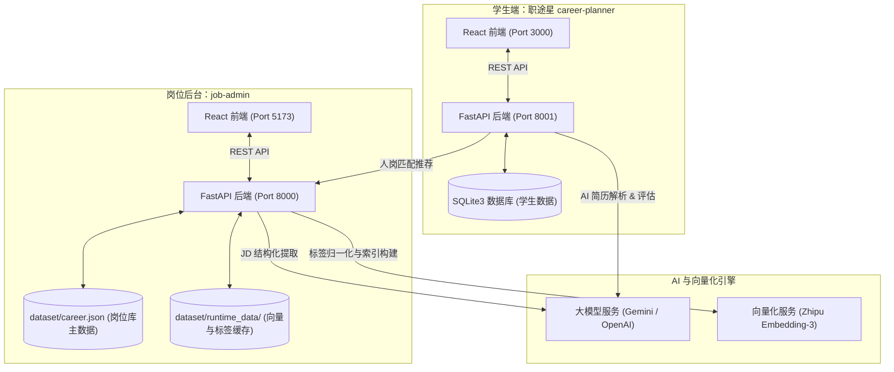
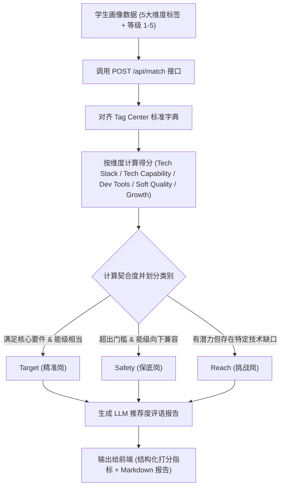

# 职途星：智能人岗匹配与数据治理系统 (AI-Driven Person-Job Matching & Data Governance System)

<p align="center">
  
</p>

<p align="center">
  <strong>一套集“AI 简历解析”、“岗位画像抽取”、“海量标签数据治理”与“多维度智能人岗匹配”于一体的双端（学生端 + 管理后台）全栈系统。</strong>
</p>

<p align="center">
  
  
  
  
  
  
  
</p>

---

## 💡 项目背景与核心特色

在传统的招聘和求职场景中，人岗匹配往往面临两大痛点：
1. **非标词泛滥（Synonym Noise）**：例如“React.js”、“react”、“前端开发框架”等在原始数据中格式混乱，直接进行字符匹配极易漏诊。
2. **匹配维度单一（One-Dimensional Matching）**：仅通过关键词包含或简单的语义相似度打分，忽略了**技术深度（Level）**、**基础原理（Principle）**、**工程经验（Engineering）**以及**软素质与潜力**的差异。

本系统通过**智能化数据治理 (Data Governance)** 和 **多维度确定性精排算法 (Deterministic Alignment)**，构建了一套科学、可度量、高可信度的人岗匹配平台。

### 📂 数据资产解耦说明 (Decoupled Dataset)
为了保持代码仓库的轻量化，本项目对大型数据资产与运行时缓存进行了**解耦隔离**：
* **本地示例数据**：项目自带的 dataset/ 仅包含**极简示例数据**（[career.json](file:///D:/1/CS&AI/个人项目/ALL/job_system - 交付版本/dataset/career.json) 仅含 5 条样本岗位）及标准词典框架，供您开箱即用快速启动。
* **全量解耦数据物理路径**：D:\1\CS&AI\个人项目\ALL\dataset
* **使用全量数据方法**：若需使用包含 10,000+ 岗位画像主数据、200MB+ 向量模型缓存的完整数据库进行测试，请**直接将全量解耦路径下的 dataset/ 文件夹整体复制并覆盖到本项目根目录下**即可。覆盖后，Git 会根据本地的 .gitignore 自动忽略大体积文件，保持仓库整洁。\n\n### 🏷️ 核心机制：专业名词全英文对齐
为了消除中文翻译的多样性与技术边界的模糊性（例如“响应式”对“Responsive”、“深度学习”对“Deep Learning”），系统在向量库构建、标签字典管理、以及精排匹配计算中，**专业技术名词一律统一使用英文标准词（English Tags）**。当学生使用中文进行检索或简历解析时，系统会自动在“选择词体验层”完成中文到英文标准词的映射，再将英文 Tag 带入后端的向量匹配和相似度计算中，从根本上消除了译名碎片化对匹配精度的负面影响。

### 🌟 核心特色
* 👥 **双客户端联动架构**：专为学生设计的“职途星 (Career Planner)”客户端与专为招聘方/管理员设计的“岗位数据管理后台 (Job Admin)”。
* 🛠️ **多级大模型抽取流水线 (Portrait Builder)**：支持一键上传原始岗位 JD 文本，通过三阶段大模型链提取结构化、标准化的岗位画像。
* 🏷️ **语义化标签归一化治理 (Tag Center & Normalization)**：利用 **Zhipu Embedding-3** 与 **Cosine Similarity** 构建语义搜索索引，结合大模型对非标准技术名词进行全量归一化，将所有词汇映射到唯一的英文标准 Key（`normalizedTag`）。
* 🎯 **三档位确定性人岗匹配 (Deterministic Matching Engine)**：基于技术栈、抽象技术能力、开发工具、软素质、成长潜力 5 大维度计算得分，将匹配结果归类为 **Safety (保底岗)**、**Target (精准岗)**、**Reach (挑战岗)**，并自动生成 LLM 匹配深度分析报告。

---

## 🏗️ 系统架构与工作流

本系统分为 **前端呈现层**、**业务服务层**、**数据与 AI 引擎层**。以下是系统的整体架构与核心数据流图：

### 1. 系统部署拓扑


### 2. 核心匹配与推荐流程


---

## 🛠️ 技术栈

| 层次 | 技术组件 | 作用与说明 |
| --- | --- | --- |
| **学生端前端** | **React 19, Vite, Tailwind CSS, React Router v7** | 极简、现代的单页面应用，包含简历上传、画像编辑、匹配可视化看板等功能。 |
| **管理后台前端** | **React 19, Vite, Tailwind CSS, Framer Motion v12** | 响应式大屏后台，包含岗位列表 CRUD、JD 批量结构化跑批、标签归一与 LLM 复查看板。 |
| **学生端后端** | **FastAPI, Uvicorn, SQLite3, SQLAlchemy** | 负责学生端账户注册登录（JWT 验证）、学生画像管理、简历解析接口。 |
| **管理后台后端** | **FastAPI, Uvicorn, Pandas, NumPy, Scikit-learn** | 系统核心业务。负责岗位数据的管理、高速向量匹配计算、标签字典同步、标签审计。 |
| **AI / 大模型** | **LangChain, OpenAI SDK, Gemini API, OpenRouter** | 负责简历内容解析、JD 结构化画像抽取、人岗匹配后的自然语言报告生成。 |
| **向量化引擎** | **Zhipu BigModel Embedding-3** | 提供高维度 (2048-dim) 的语义向量服务，支撑中文标签搜索与聚类。 |

### 🤖 推荐模型参考配置 (AI Reference Models)
为了保障系统的高性能与格式化 JSON 稳定性，在生产或本地部署时，推荐配置如下大模型及向量方案：
* **向量模型 (Embedding Model)**: **智谱 `embedding-3`** (2048维高性能向量，作为系统中标准词构建、相似性聚类以及高维语义表示的核心向量工具)。
* **大模型 (LLM Model)**: 
  * 核心格式化与轻量级跑批任务：**`DeepSeek-v3.2`** (注：官网目前已下架此版本，推荐采用 **`DeepSeek-v4-flash`** 替代，用于极速的 JSON 格式化输出与画像自动化跑批流水线)。
  * 深度匹配报告与分析：**`Gemini-3.5-Flash`** 或 **`GPT-4o-mini`** (通过极速响应生成人岗推荐度评语与详细分析报告)。

---

## 📂 目录结构与关键入口

```text
job_system/
├── career-planner/                       # 学生端客户端项目
│   ├── backend/                          # FastAPI 后端源码
│   │   └── app.py                        # 学生端后端主入口 (Port 8001)
│   ├── frontend/                         # React 前端源码
│   │   └── src/                          # 学生端页面与组件 (Port 3000)
│   ├── data/                             # 学生端本地 SQLite 数据库目录
│   └── README.md                         # 学生端子说明文档
│
├── job-admin/                            # 岗位数据管理后台
│   ├── backend/                          # FastAPI 后端源码
│   │   ├── app.py                        # 后端服务主入口 (Port 8000)
│   │   ├── job_profile_schema.py         # 标准岗位画像 Schema 与数据清洗逻辑
│   │   ├── tag_sync.py                   # 标签同步与向量索引缓存重建逻辑
│   │   └── portrait_builder/             # JD 画像多级抽取 Pipeline 核心实现
│   └── frontend/                         # React 前端源码
│       └── src/                          # 管理后台页面与组件 (Port 5173)
│
├── dataset/                              # 共享数据资产中心 (主数据/缓存/日志)
│   ├── career.json                       # 岗位库全局主数据 JSON (核心资产)
│   └── db/tag_center/                    # 标准标签体系与向量索引缓存
│
├── docs/                                 # 详细的设计文档与 API 契约说明
│   ├── README.md                         # 后端文档索引
│   ├── backend_01_job_profile_schema.md  # 岗位画像字段定义
│   ├── backend_02_pipe_workflow.md       # JD 画像抽取 Pipe 工作流
│   ├── backend_03_normalization_and_review.md # 归一化与复查机制
│   └── matching_algorithm.md             # 人岗匹配算法打分明细
│
├── requirements.txt                      # Python 后端依赖声明
├── start_all.py                          # 统一启动脚本 (一键启动四端口)
└── README.2026.5.bak                     # 历史版本备份 README (带有 2026.5 时间戳)
```

---

## 🚀 快速启动指南

### 1. 安装依赖

确保本地已安装 Python 3.10+ 和 Node.js (v18+ 推荐)。

**安装 Python 依赖：**
```powershell
pip install -r requirements.txt
```

**安装前端 Node 依赖：**
系统包含两个独立的前端，需要分别安装：
```powershell
# 1. 安装学生端前端依赖
cd career-planner/frontend
npm install
cd ../..

# 2. 安装岗位管理端前端依赖
cd job-admin/frontend
npm install
cd ../..
```

### 2. 配置环境变量

1. 复制根目录下的 `.env.example` 并重命名为 `.env`。
2. 配置你的大模型 API 密钥（可配置 OpenAI, Gemini 或 OpenRouter 兼容的接口），配置示例如下：
   ```ini
   # 学生端 AI 配置
   CAREER_PLANNER_AI_LLM_BASE_URL=https://api.example.com/v1
   CAREER_PLANNER_AI_LLM_API_KEY=your-api-key
   CAREER_PLANNER_AI_LLM_MODEL=gemini-3-flash-preview

   # 智谱向量化 API 配置 (用于标签治理和相似性匹配)
   JOB_SYSTEM_BIGMODEL_VECTOR_API_KEY=your-zhipu-api-key
   ```
3. *(对于 Career Planner 登录态)*，配置 `CAREER_PLANNER_JWT_SECRET` 为一个随机的长字符串。

### 3. 一键启动 (推荐)

在仓库根目录下，运行我们提供的统一编排启动脚本：
```powershell
python start_all.py
```
该脚本将执行以下操作：
1. 检测 `.env` 配置文件。
2. 扫描端口 `3000` (学生端前端), `8001` (学生端后端), `8000` (管理端后端), `5173` (管理端前端) 是否空闲。
3. 自动检测对应的前后端目录，并发启动这 4 个服务。

> [!IMPORTANT]
> **请等待 8000 后端真正初始化完成**：
> 首次启动时，`8000` 端口后端服务会读取 [dataset/career.json](file:///D:/1/CS&AI/个人项目/ALL/job_system - 交付版本/dataset/career.json) 并自动在 `dataset/runtime_data/` 中重建运行时内存索引（约需 10 秒左右）。
> 建议在控制台看到 `Runtime state initialized...` 日志后，再开始在前端页面上操作匹配或进行画像编辑。

---

## 🛠️ 单独模块启动与构建

如果不需要同时调试四个服务，你可以使用以下命令单独启动指定模块。

### 运行学生端 (FastAPI + React)
```powershell
# 使用内置脚本启动学生端完整前后端
python ./career-planner/start.py
```
* **学生前端主页**：`http://localhost:3000`
* **学生后端接口文档**：`http://localhost:8001/docs`

### 运行岗位后台后端 (FastAPI)
```powershell
python ./job-admin/backend/app.py
```
* **管理后台后端主页**：`http://127.0.0.1:8000/`
* **接口交互文档 (Swagger)**：`http://127.0.0.1:8000/docs`

### 运行岗位后台前端 (React/Vite)
```powershell
cd job-admin/frontend
npm run dev
```
* **管理后台前端主页**：`http://localhost:5173`

---

## 🎯 核心算法细节

系统的匹配机制分为 **多指标匹配分值计算** 与 **匹配度档位评估** 两大步。

### 1. 契合度评分 (Dimensional Scoring)
系统基于以下公式对各维度标签加权计算总分：
$$\\text{Score} = w_{\\text{stack}} \\cdot S_{\\text{stack}} + w_{\\text{cap}} \\cdot S_{\\text{cap}} + w_{\\text{tool}} \\cdot S_{\\text{tool}} + w_{\\text{soft}} \\cdot S_{\\text{soft}} + w_{\\text{growth}} \\cdot S_{\\text{growth}}$$
* 每一个标签计算不仅看“是否命中（Key Matching）”，还要考虑学生当前的**能力级别**（`level`）与岗位**目标要求级别**的落差。
* 如果学生的能力级别高于岗位要求的级别，该标签按满分计算且溢出值（Overflow）会作为亮点记录；如果低于目标级别，则会扣除对应的能级落差分，并在匹配明细中记录为 `level_mismatches`。

### 2. 匹配度分档机制 (Three-Tier Classification)
* **保底岗 (Safety)**：技术栈完全覆盖，能级向下兼容，技术缺口为 0。
* **精准岗 (Target)**：技术覆盖度与能级达到黄金契合区间。
* **挑战岗 (Reach)**：存在一定的核心技能缺口，或者目标能级显著高于当前能级，但适合作为学习成长目标。

> [!NOTE]
> 欲深入了解打分与分档的详细矩阵和公式，请参阅设计文档 [matching_algorithm.md](file:///D:/1/CS&AI/个人项目/ALL/job_system - 交付版本/docs/matching_algorithm.md)。


