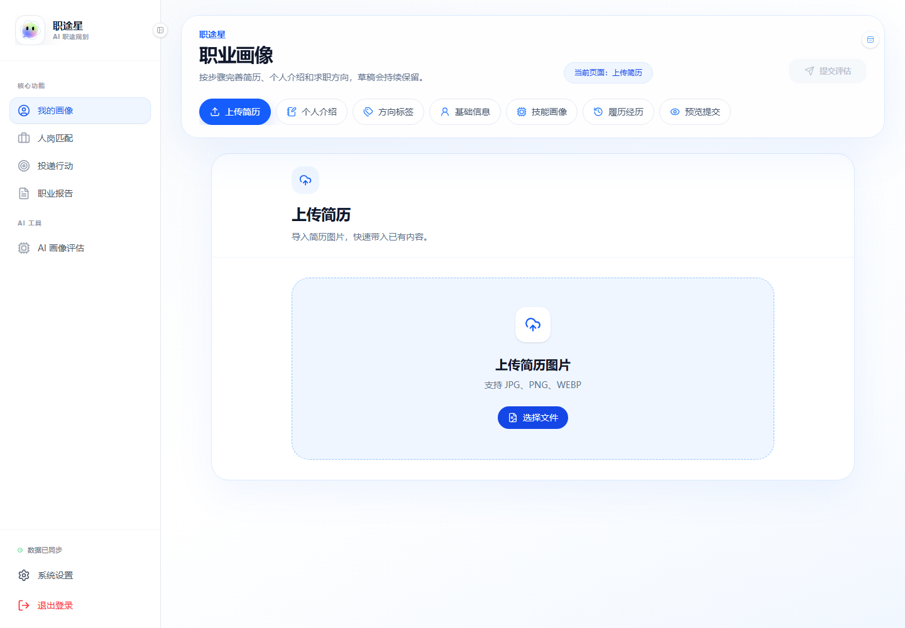
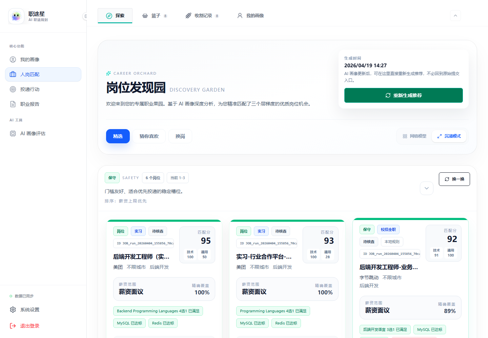
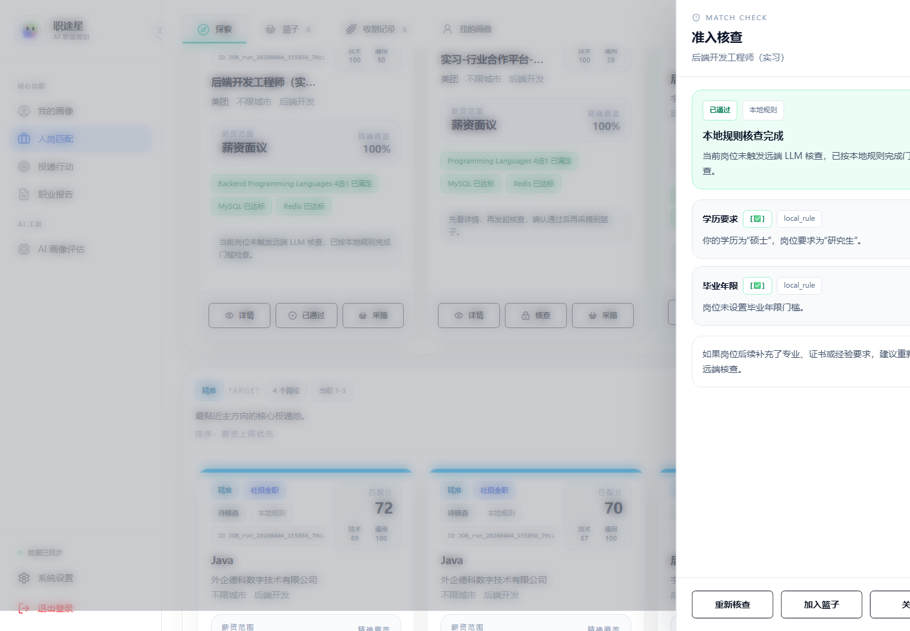
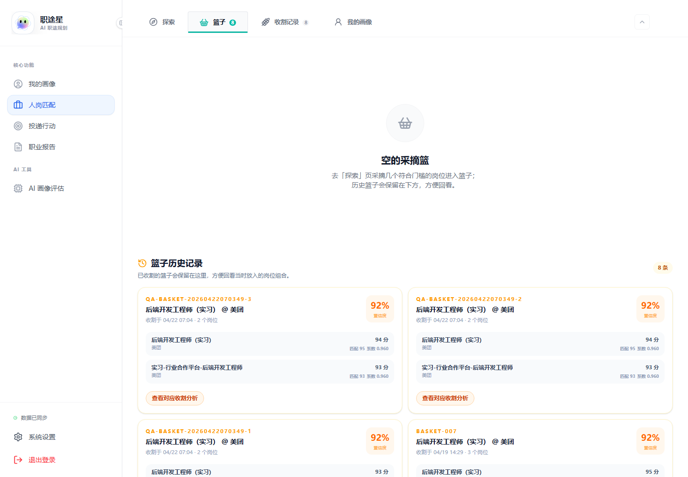
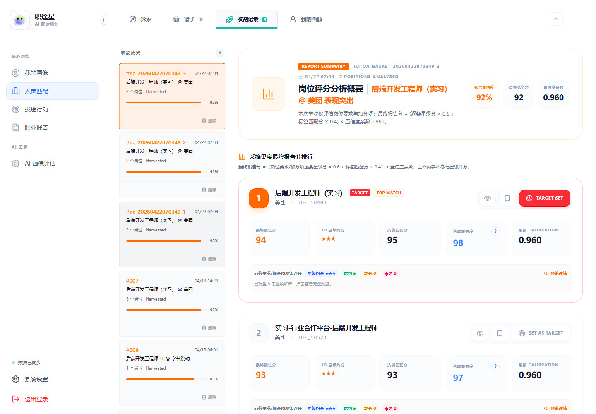
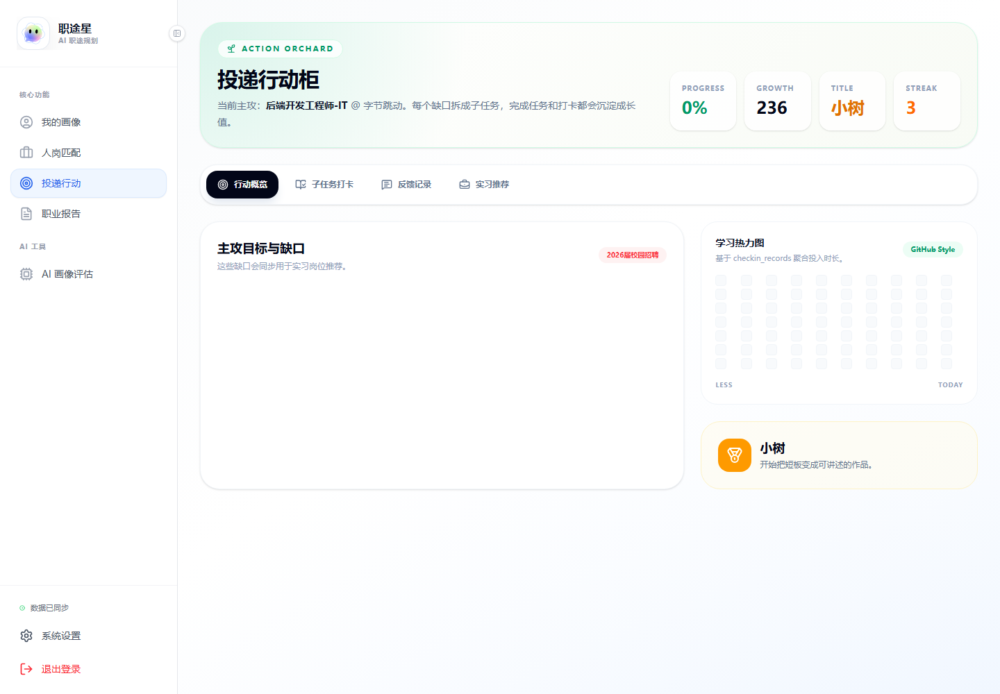
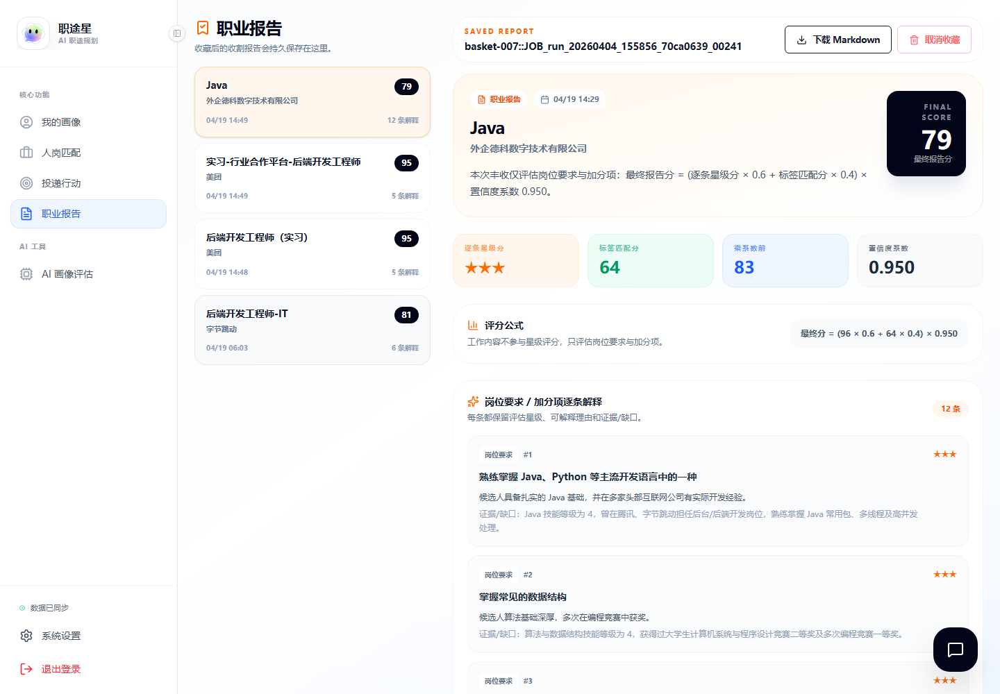
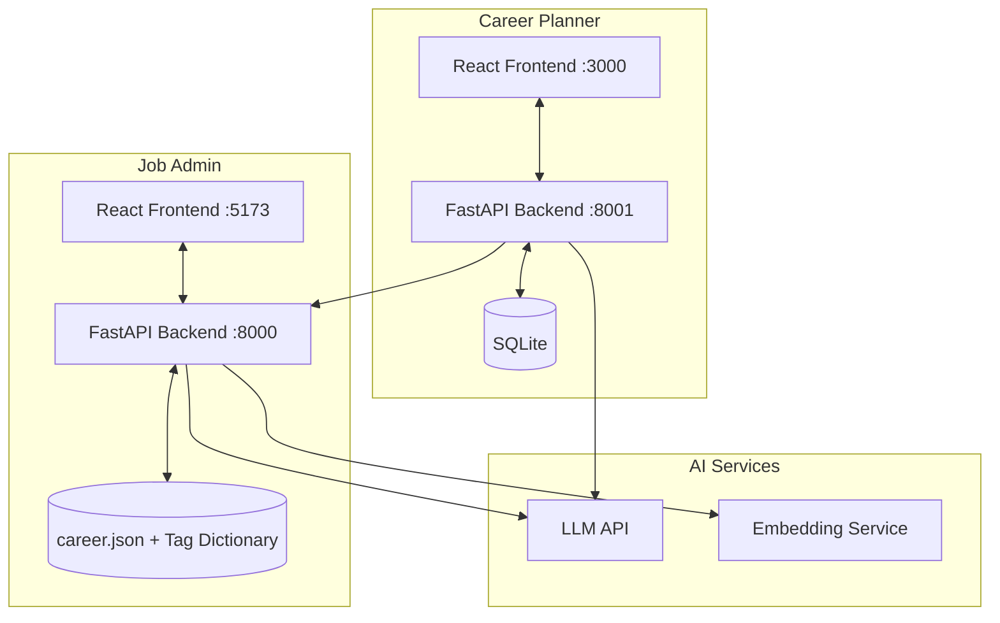

# AI Job Match — Intelligent Person-Job Matching System

<p align="center">
  
</p>

<p align="center">
  <a href="./README.md">中文</a>
</p>

<p align="center">
  <a href="https://www.bilibili.com/video/BV1HwEi6pECu" target="_blank">
    
  </a>
  &nbsp;&nbsp;
  <a href="https://ztx.6767.chat" target="_blank">
    
  </a>
</p>

<p align="center">
  
  
  
  
  
  
</p>

---

## Overview

An LLM-powered person-job matching system with two client applications.

The **Career Planner** (student-facing) supports resume upload, skill profile building, tag management, and intelligent job matching. The **Job Admin** (management console) handles job data entry, JD structured extraction, tag normalization, and matching engine administration.

The core approach: decompose both student and job profiles into structured tags across five dimensions (tech stack, technical abilities, dev tools, soft skills, growth potential), then compute matches through tag-level alignment with level-gap scoring, producing explainable results with gap analysis.

---

## Screenshots

| Login | Profile Editor |
|:---:|:---:|
|  |  |

| Job Exploration | Match Detail |
|:---:|:---:|
|  |  |

| Job Basket | Harvest Analysis |
|:---:|:---:|
|  |  |

| Action Plan | Career Report |
|:---:|:---:|
|  |  |

---

## Architecture

Two independent full-stack apps sharing a common dataset and tag vocabulary:



- Career Planner backend calls Job Admin's matching API for recommendations
- Job Admin maintains the job database, tag index, and vector cache
- All LLM calls use OpenAI-compatible endpoints, supporting multiple providers

---

## Tech Stack

| Layer | Technology | Purpose |
|---|---|---|
| Frontend | React 19 + Vite + Tailwind CSS | Two independent SPAs |
| Backend | FastAPI + Uvicorn | Career Planner :8001, Job Admin :8000 |
| Database | SQLite (students), JSON files (jobs) | Lightweight, no external DB required |
| AI Models | OpenAI-compatible API (flagship + fast + embedding) | GPT / Claude / DeepSeek supported |
| Embeddings | Zhipu Embedding-3 (2048-dim) | Semantic tag search and normalization |
| Data Processing | NumPy + Pandas + Scikit-learn | Scoring and vector computation |

---

## Quick Start

### Requirements

- Python 3.10+
- Node.js 18+

### Install Dependencies

```bash
pip install -r requirements.txt

cd career-planner/frontend && npm install && cd ../..
cd job-admin/frontend && npm install && cd ../..
```

### Configure Environment

Copy `.env.example` to `.env` and fill in your model API keys:

```ini
# Flagship model (resume parsing, report generation, job profile extraction)
JOB_SYSTEM_FLAGSHIP_LLM_BASE_URL=https://api.example.com/v1
JOB_SYSTEM_FLAGSHIP_LLM_API_KEY=your-key
JOB_SYSTEM_FLAGSHIP_LLM_MODEL=gpt-5.4

# Fast model (classification, lightweight tasks)
JOB_SYSTEM_FAST_LLM_BASE_URL=https://api.example.com/v1
JOB_SYSTEM_FAST_LLM_API_KEY=your-key
JOB_SYSTEM_FAST_LLM_MODEL=gpt-5.4-mini

# Embedding model (semantic search, tag normalization)
JOB_SYSTEM_EMBEDDING_BASE_URL=https://open.bigmodel.cn/api/paas/v4
JOB_SYSTEM_EMBEDDING_API_KEY=your-key
JOB_SYSTEM_EMBEDDING_MODEL=embedding-3

# JWT secret (for student login)
CAREER_PLANNER_JWT_SECRET=your-random-string
```

### Start All Services

```bash
python start_all.py
```

Once running:
- Career Planner: http://localhost:3000
- Job Admin: http://localhost:5173
- Career Planner API docs: http://localhost:8001/docs
- Job Admin API docs: http://localhost:8000/docs

> On first startup, the Job Admin backend needs ~10 seconds to build vector indices. Wait for `Runtime state initialized` in the console before using the UI.

### Demo Account

A pre-configured student account with a populated profile is available:

| Username | Password |
|---|---|
| admin | 123456 |

### About Sample Data

The bundled `dataset/career.json` contains ~100 job profile samples (covering 21 tech directions) for demonstration purposes only. These are synthetically generated and do not represent real job postings. To use real data, upload JDs through the Job Admin console to auto-generate structured profiles.

---

## Matching Algorithm

The system decomposes profiles into five scoring dimensions:

1. **Tech Stack** — programming languages, frameworks
2. **Technical Abilities** — algorithms, architecture design
3. **Dev Tools** — IDEs, CI/CD, cloud services
4. **Soft Skills** — communication, collaboration, leadership
5. **Growth Potential** — learning ability, project depth

Each tag carries a proficiency level (1-5). Matching aligns tags between student and job profiles, computes level gaps, and produces a weighted total score. Jobs are classified into three tiers:

- **Safety** — student fully covers requirements with matching or higher levels
- **Target** — core skills match within a reasonable level range
- **Reach** — skill gaps exist, suitable as growth targets

Results include specific matched tags, missing tags, and level-gap analysis, with optional AI-generated detailed reports.

See [docs/matching_algorithm.md](docs/matching_algorithm.md) for full details.

---

## Project Structure

```
ai-job-match/
├── career-planner/          # Student-facing app
│   ├── backend/             # FastAPI backend (:8001)
│   └── frontend/            # React frontend (:3000)
├── job-admin/               # Admin console
│   ├── backend/             # FastAPI backend (:8000)
│   └── frontend/            # React frontend (:5173)
├── dataset/                 # Shared data
│   ├── career.json          # Job database
│   └── db/                  # Tag dictionary & vector indices
├── shared/                  # Common utilities
├── docs/                    # Design docs
├── start_all.py             # Launch script
└── requirements.txt         # Python dependencies
```

---

## Documentation

| Document | Content |
|---|---|
| [Job Profile Schema](docs/backend_01_job_profile_schema.md) | Job data structure and fields |
| [JD Extraction Pipeline](docs/backend_02_pipe_workflow.md) | Raw JD to structured profile |
| [Tag Normalization](docs/backend_03_normalization_and_review.md) | Deduplication, clustering, standardization |
| [Matching Algorithm](docs/matching_algorithm.md) | Scoring formulas and tier logic |
| [API Reference](docs/backend_05_api_catalog.md) | All REST API endpoints |
| [LLM Configuration](docs/backend_04_llm_env_config.md) | Model selection and env vars |

---

## Contributors

<table>
  <tr>
    <td align="center"><a href="https://github.com/connectedGraph"><br /><sub>connectedGraph</sub></a></td>
    <td align="center"><a href="https://github.com/sedsej"><br /><sub>sedsej</sub></a></td>
    <td align="center"><a href="https://github.com/zzZ-1ovo"><br /><sub>zzZ</sub></a></td>
  </tr>
</table>

---

## License

MIT
