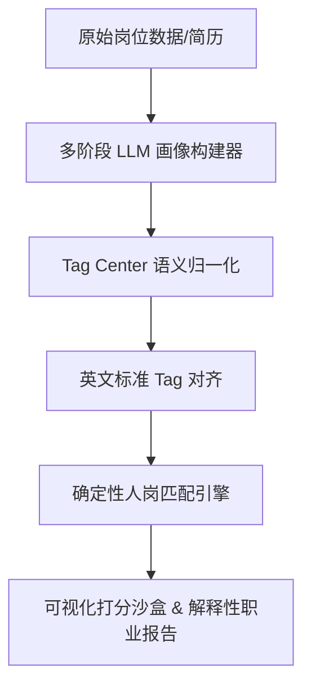

# 系统概述与架构设计 (01_overview_architecture.md)

本页面详细阐述了 **职途星 (Career Planner)** 与 **岗位数据管理后台 (Job Admin)** 系统的项目背景、核心要解决的痛点问题、核心机制设计、部署拓扑结构、完整的目录树结构定位以及系统快速启动与配置说明。

---

## 1. 系统背景与解决的核心痛点

在传统的招聘求职和人岗匹配场景中，往往面临着结构化数据粗糙、语义对齐困难、评估逻辑黑盒化等问题。本系统聚焦于解决以下三大核心痛点问题：

### 1.1 非标准技术词的同义词噪点 (Non-standard Terms Synonym Noise)
* **痛点表现**：在不同的招聘简章（JD）和学生简历中，同一门技术存在大量的书写变体。例如：`React`、`react.js`、`ReactJS`、`前端开发React`；或者 `Spring Boot`、`springboot`、`Springboot` 等。在传统的关键词检索中，这会导致大量的错漏匹配，使关键词检索非常脆弱。
* **对策**：引入 **标准英文 Tag 语义对齐机制**。系统在后台将所有的技术词汇、工具、能力抽取后，通过映射和向量聚类，强制将其归一化到唯一的标准英文标签（如统一归一为 `React` 或 `Spring Boot`），消除大小写、空格、缩写及中英文混合书写带来的同义词噪声。

### 1.2 纯语义向量相似度匹配的黑盒失配 (Black-box Embedding Similarity Mismatch)
* **痛点表现**：纯依靠 Embedding（词向量）余弦相似度的语义匹配是一种“黑盒”机制，无法提供直观的、可解释的匹配理由。此外，由于向量空间的连续性，经常会出现语义漂移和荒谬的误匹配。例如：由于都是后端技术岗位，系统可能认为“Python 研发工程师”和“Java 研发工程师”的向量极度相似，从而错误地向一名只懂 Python 的学生大量推荐 Java 岗位。
* **对策**：采用 **确定性逻辑匹配引擎 (Deterministic Matching Engine)**。语义相似度（Embedding）仅被用在前端的“选词/补全”以及匹配前的“模糊标签召回阶段”。在最终决定匹配分档和分数的阶段，系统完全基于标准的英文 Tag、抽象技术能力（Tech Capabilities）以及对应的硬性要求等级（Level Required），运行一套清晰可追溯的加权匹配公式，提供透明且极具说服力的“匹配报告”，避免黑盒决策。

### 1.3 缺乏“自我认知”的多维学生画像 (Lack of Self-aware Student Profiles)
* **痛点表现**：学生在撰写简历时，常常面临关键词遗漏、无法客观量化自身技术等级、缺乏宏观技术领域视野的问题。传统的简历解析服务只是做粗粒度的词表匹配，无法生成对自身技术栈、软素质、发展潜力进行立体化自评估的画像。
* **对策**：内置 **多阶段大模型学生画像构建器 (Multi-stage LLM Portrait Builder)**。通过对学生简历进行深入的级联推理，解析出包含基础学历、技术栈、核心专业技术能力（包含能级推断 1~4 级）、使用工具、软性素质以及成长潜力的多维立体化结构，帮助学生构建出具备“自我深度认知”的结构化画像。

---

## 2. 系统核心机制设计

为了从根本上解决上述痛点，系统底层设计了四大互相配合的核心机制：



* **多阶段大模型画像构建器 (Multi-stage LLM Portrait Builder)**：
  系统在解析非结构化文本时，拒绝“单次 Prompt 直接产出结果”的粗糙设计，转而采用级联式（Cascading）处理流。以岗位画像抽取为例，它分为字段定位还原、基础信息解析、结构化切分、句子级分类（拆分出技术性、软性与噪点句子）、并行提取（技术栈与工具提取、软素质提取）等多阶段，以此来保证超高的数据抽取准确率与结构化纯净度。
* **语义归一化 (Semantic Normalization)**：
  任何进入系统的标签，都需通过 `tag_sync.py` 执行语义归一操作。对频次高于阈值的核心词汇构建本地聚类池（Similarity Pools），对频次较低的噪音词汇使用大模型结合语义向量映射回最接近的“黄金标签”。
* **英文 Tag 对齐 (English Tag Alignment)**：
  使用全系统统一的标准化英文词条作为键（Key）来进行索引与比对，防止中文译名的细微差异（例如“数据库”与“DB”、“微服务”与“Microservices”）影响技术边界的精准计算。
* **确定性匹配算法 (Deterministic Matching)**：
  基于对齐后的英文 Tag 以及技术能力等级进行两层过滤（硬性匹配过滤与语义相似度召回补偿），之后输入至确定性打分矩阵。计算出匹配得分（Match Score）、竞争力得分（Competitiveness Score）和毕业吻合度（Graduation Fit），最终划分为“保守岗 (Safety)”、“精准岗 (Target)”和“冲刺岗 (Reach)”三档，并自动输出逐条对应的图表解释。

---

## 3. 部署拓扑结构

整个系统在本地开发或交付部署时，通过统一配置拉起，构成双客户端与双服务端的四端口联动拓扑结构，其整体通信网络如下：

```
                              [ React 19 学生客户端 ]
                                 (Port: 3000)
                                      |
                                      | HTTP API
                                      v
                               [ FastAPI 学生后端 ]
                                 (Port: 8001)
                                      |
                       +--------------+--------------+
                       |              |              |
                       v              v              v
               [ SQLite 数据库 ]  [ 岗位库数据 ]  [ LLM/Embedding 接口 ]
                (career_planner.  (career.json)  (Flagship/Fast/Embedding)
                   sqlite3)           ^              ^
                                      |              |
                       +--------------+--------------+
                       |              |
                       v              v
                               [ FastAPI 管理后端 ]
                                 (Port: 8000)
                                      ^
                                      | HTTP API
                                      |
                              [ React 19 管理前端 ]
                                 (Port: 5173)
```

### 3.1 端口与角色定义

1. **React 19 学生端前端 (Career Planner Frontend)**
   * **运行端口**：`3000`
   * **主要功能**：供学生注册登录、上传简历、交互式编辑职业画像、查看智能匹配岗位列表、查看深度人岗匹配报告与行动规划指南。
2. **FastAPI 学生端后端 (Career Planner Backend)**
   * **运行端口**：`8001`
   * **主要功能**：处理学生端核心 API 请求，读取/修改 SQLite 数据库，读取共享的岗位库文件，调用大模型对学生画像进行评估。
3. **React 19 管理端前端 (Job Admin Frontend)**
   * **运行端口**：`5173`
   * **主要功能**：提供岗位治理看板，支持上传 raw JD 运行批处理抽取任务，进行岗位 CRUD 维护，提供人岗匹配打分沙盒调试，提供标签归一与审核治理界面。
4. **FastAPI 管理端后端 (Job Admin Backend)**
   * **运行端口**：`8000`
   * **主要功能**：承载所有岗位管理、Tag 归一任务流程、Tag Review 任务队列控制、大模型抽取流水线管理等，是整个系统的数据治理中枢。

### 3.2 数据存储与资产库
* **SQLite 数据库**：存放于 [career_planner.sqlite3](file:///D:/1/CS&AI/个人项目/ALL/job_system - 交付版本/dataset/career_planner/career_planner.sqlite3)。仅被学生端后端使用，用于保存用户账号、多版本学生画像、匹配沙盒草稿以及解析历史。
* **公共岗位库**：存放于 [career.json](file:///D:/1/CS&AI/个人项目/ALL/job_system - 交付版本/dataset/career.json)。系统的主体数据资产，供两端后端并发读取，管理端负责对其进行更新。
* **Tag 资产中心**：存放于 [dataset/db/tag_center/](file:///D:/1/CS&AI/个人项目/ALL/job_system - 交付版本/dataset/db/tag_center/)，存放规范化主字典及翻译缓存。
* **Domain 资产中心**：存放于 [dataset/db/domain_center/](file:///D:/1/CS&AI/个人项目/ALL/job_system - 交付版本/dataset/db/domain_center/)，存放技术领域 master 字典及热度指标。

### 3.3 AI 服务端点交互
全系统底层需要调用以下三类 AI 服务端点（可通过环境变量分别路由至不同的 API 提供商）：
* **旗舰模型 (Flagship LLM)**：用于复杂推理，如简历结构化解析、生成深度匹配报告、逐条解析评估等。
* **快速模型 (Fast LLM)**：用于低延迟轻量任务，如中英文标签翻译、简单分类或广告文案过滤。
* **向量模型 (Embedding Model)**：用于高并发技术标签检索及归一化聚类计算。

---

## 4. 项目目录树结构与关键文件说明

以下是该项目的完整代码目录树，以及各目录、关键文件的详细用途说明：

```
job_system/
├── start_all.py                        # 全局多进程编排启动脚本
├── requirements.txt                    # 统一 Python 依赖包清单
├── .env                                # 本地环境变量配置文件（需从 .env.example 复制）
├── .env.example                        # 环境变量模板文件
├── shared/                             # 双端共享库目录
│   ├── __init__.py
│   └── llm_resilience.py               # 大模型网络韧性调用模块（退避重试、限流并发控制）
├── dataset/                            # 全系统公共数据集与数据库资产目录
│   ├── career.json                     # 统一标准岗位库 JSON 数据库
│   ├── career_planner/                 
│   │   └── career_planner.sqlite3      # 学生端 SQLite 关系数据库
│   └── db/
│       ├── tag_center/                 # 标签中心资产目录（存放 master 字典、高频索引及缓存）
│       └── domain_center/              # 领域中心资产目录（存放抽象专业领域及统计）
├── career-planner/                     # 1. 学生端 (Career Planner) 工作区
│   ├── start.py                        # 学生端独立启动脚本
│   ├── backend/                        # 学生端后端项目
│   │   ├── app.py                      # 学生端后端主入口（路由注册与生命周期管理）
│   │   ├── config.py                   # 读取 .env，解析 Flagship/Fast 配置及存储路径
│   │   ├── storage.py                  # SQLite 实体定义、表建立与 SQL 交互方法
│   │   ├── evaluation.py               # 简历 AI 解析推理及多维能级评估核心算法
│   │   ├── tech_capability.py          # 对接标签中心，处理学生技能的本地语义搜索索引
│   │   ├── llm_client.py               # 包装 shared 下的韧性调用模块
│   │   ├── prompts.py                  # 学生端大模型 Prompt 模板合集
│   │   ├── security.py                 # JWT 签名、校验与用户密码 Hashing (bcrypt) 模块
│   │   └── verify_prompt.py            # 本地调试 Prompts 合规性的快捷工具
│   └── frontend/                       # 学生端前端项目 (React 19 + Tailwind CSS)
│       └── src/                        
│           ├── pages/                  # 核心路由页面（AiEval, Profile, ImmersiveDiscovery 等）
│           └── App.jsx                 # 前端根组件
└── job-admin/                          # 2. 管理端 (Job Admin) 工作区
    ├── frontend/                       # 管理端前端项目 (React 19 + Tailwind CSS)
    └── backend/                        # 管理端后端项目
        ├── app.py                      # 管理端后端主入口（FastAPI 路由组装与静态托管挂载）
        ├── project_paths.py            # 全局物理路径映射及运行时目录初始化
        ├── job_profile_schema.py       # 顶层岗位画像定义、类型规范校验与 normalize 方法
        ├── tag_sync.py                 # 标签资产同步治理、全量更新、中英翻译的核心 CLI 引擎
        ├── migrate_techstack_to_capabilities.py # 技术栈迁移脚本
        ├── backend_app/                # 后端逻辑代码包
        │   ├── app_factory.py          # 挂载中间件、CORS 及静态目录的前后端组装工厂
        │   ├── config.py               # 本地日志记录器及静态文件路径配置
        │   ├── model_config.py         # 专门解析大模型、多版本向量配置的配置中心
        │   ├── runtime_state.py        # 内存运行态管理（岗位库热加载、并发读取锁）
        │   ├── job_data_service.py     # 岗位数据的读写、过滤、CRUD 事务维护
        │   ├── matching_service.py     # 确定性匹配引擎算法（打分公式、等级差折损）
        │   ├── tag_center_service.py   # 查询标准 Tag 主字典与标签反解析接口
        │   ├── normalization_service.py # 归一化任务调度与状态机接口
        │   ├── tag_review_service.py   # 人工审核任务 manifest 管理器
        │   ├── tag_review_runtime.py   # 执行大模型审核与写入的核心状态机控制流
        │   └── match_config.py         # 人岗匹配权重常数、分层规则及阈值表
        └── portrait_builder/           # 画像批处理大模型流水线包 (Portrait Ingestion)
            ├── __init__.py
            ├── api_processing.py       # 大模型三阶段级联抽取具体 Prompt 调用及任务逻辑
            ├── pipeline_core.py        # 并发批处理核心控制管道、日志控制和断点续传
            └── taxonomy.py             # 注册标准方向 (Direction) 和软性/成长潜力的固定维度
```

### 4.1 当前接口维护入口

管理端后端以 `backend_app/app_factory.py` 注册多个 `APIRouter`，学生端后端则在 `career-planner/backend/app.py` 内集中声明路由。维护接口时优先查看下表：

| 功能域 | 路由/入口文件 | 说明 |
| --- | --- | --- |
| 学生端认证、画像、工作区、AI 评估 | `career-planner/backend/app.py` | `/api/auth/*`、`/api/user-data`、`/api/student-profile/*`、`/api/ai/*`、学生端 `/api/match*` 代理 |
| 学生端持久化 | `career-planner/backend/storage.py` | SQLite 表初始化、用户、画像、提交历史、match workspace |
| 学生端标签/领域搜索 | `career-planner/backend/tech_capability.py` | Tag Center、Domain Center、中文语义搜索、推荐 |
| 管理端 App 工厂 | `job-admin/backend/backend_app/app_factory.py` | CORS、统一错误格式、静态托管、router 注册 |
| 岗位查询 | `job-admin/backend/backend_app/job_routes.py` | `/api/jobs`、`/api/careers`、metadata |
| 后台管理与岗位 CRUD | `job-admin/backend/backend_app/admin_routes.py` | `/api/admin/summary`、标签查询、导出、岗位新增/更新/删除 |
| 匹配接口聚合 | `job-admin/backend/backend_app/matching_routes/__init__.py` | 注册 run/check/harvest/internship/insight/debug 子路由 |
| 匹配算法 | `job-admin/backend/backend_app/matching_service.py` | `run_match`、`run_match_harvest`、`run_match_insight`、`recommend_internship_jobs` |
| 单岗位准入核查 | `job-admin/backend/backend_app/match_check_service.py` | 学历/毕业年规则核查，专业/证书/经历 LLM 核查与降级 |
| 标签归一与复查路由 | `job-admin/backend/backend_app/normalization_routes.py` | `/api/admin/normalization/*` |
| Builder 路由聚合 | `job-admin/backend/portrait_builder_api.py` | 外部前缀 `/api/builder` |
| Builder 上传/模型配置 | `job-admin/backend/portrait_builder/api_routes_uploads.py` | `/api/builder/uploads`、`/api/builder/models`、`/api/builder/configs/*` |
| Builder run 控制 | `job-admin/backend/portrait_builder/api_routes_runs.py` | `/api/builder/runs*`、pause/resume/retry/apply/revoke/artifacts |

完整接口契约见 [04_api_reference.md](file:///D:/1/CS&AI/个人项目/ALL/job_system - 交付版本/docs/wiki/04_api_reference.md)，完整页面交互见 [05_ui_interactions.md](file:///D:/1/CS&AI/个人项目/ALL/job_system - 交付版本/docs/wiki/05_ui_interactions.md)。

---

## 5. 快速启动与环境变量配置

### 5.1 环境变量文件配置 (.env)

为了使系统能够正常调用 AI 服务进行简历解析与标签归一，必须在项目根目录下创建一个 `.env` 环境变量文件。各核心变量的详细说明如下：

#### 5.1.1 旗舰模型配置 (JOB_SYSTEM_FLAGSHIP_LLM_*)
旗舰模型负责复杂的推理任务。例如：简历的深层抽取、生成人岗匹配的诊断报告、能级划分等。
* `JOB_SYSTEM_FLAGSHIP_LLM_BASE_URL`：兼容 OpenAI 协议的 `/v1/chat/completions` 服务端点路径。
* `JOB_SYSTEM_FLAGSHIP_LLM_API_KEY`：API 访问密钥。
* `JOB_SYSTEM_FLAGSHIP_LLM_MODEL`：模型名称，推荐使用推理能力强的模型，例如 `gpt-5.4`、`claude-3-5-sonnet`、`deepseek-chat`。
* `JOB_SYSTEM_FLAGSHIP_LLM_TEMPERATURE`：采样温度，推荐使用低值（例如 `0.3`）以保证推理的逻辑严密性与 JSON 格式的稳定性。
* `JOB_SYSTEM_FLAGSHIP_LLM_TIMEOUT_SECONDS`：请求超时设定，建议为 `120` 秒。

#### 5.1.2 快速模型配置 (JOB_SYSTEM_FAST_LLM_*)
快速模型用于处理简单、低延迟的辅助任务。例如：轻量的广告判定、非标词的中英文快速互译等。
* `JOB_SYSTEM_FAST_LLM_BASE_URL`：快速模型的 API 路径。
* `JOB_SYSTEM_FAST_LLM_API_KEY`：API 密钥。
* `JOB_SYSTEM_FAST_LLM_MODEL`：推荐使用轻量级小模型，如 `gpt-5.4-mini`、`claude-3-5-haiku`、`deepseek-flash`。
* `JOB_SYSTEM_FAST_LLM_TEMPERATURE`：采样温度，强制设为 `0` 以保证输出的高度确定性。
* `JOB_SYSTEM_FAST_LLM_TIMEOUT_SECONDS`：超时限制，设为 `60` 秒即可。

#### 5.1.3 向量模型配置 (JOB_SYSTEM_EMBEDDING_*)
向量模型用于标签在向量空间中的两两相似度计算与中文语义搜索召回。
* `JOB_SYSTEM_EMBEDDING_BASE_URL`：符合 OpenAI 协议的向量模型接口（如 `https://open.bigmodel.cn/api/paas/v4`）。
* `JOB_SYSTEM_EMBEDDING_API_KEY`：向量 API 密钥。
* `JOB_SYSTEM_EMBEDDING_MODEL`：向量模型名称，如 `embedding-3`。
* `JOB_SYSTEM_EMBEDDING_DIMENSIONS`：向量维度，系统默认设置为 `2048`。
* `JOB_SYSTEM_EMBEDDING_BATCH_SIZE`：单次批处理调用大小，默认 `64`。

#### 5.1.4 系统安全与辅助配置
* `CAREER_PLANNER_JWT_SECRET`：用于学生端用户登录 JWT Token 签名的加盐私钥，推荐在部署时更换为随机字符串。
* `CAREER_PLANNER_JWT_EXPIRE_MINUTES`：Token 有效期，默认 `10080`（7天）。
* `JOB_SYSTEM_JOB_LIBRARY_PATH`：指定岗位库的自定义物理绝对路径，若留空，则默认使用 `dataset/career.json`。

### 5.2 统一多进程启动编排 (start_all.py)

系统提供了一个一体化的多进程启动脚本 `start_all.py`。该脚本负责启动系统的所有四个组件，并对本地运行环境进行自动检测与配置分发。

#### 5.2.1 启动机制与行为步骤
执行 `python start_all.py` 时，脚本会自动执行以下前置校验与子进程管理步骤：
1. **自动读取环境变量**：优先读取项目根目录下的 `.env` 文件，将其注入到系统的 `os.environ` 运行态中。
2. **本地端口占用检测**：遍历定义好的服务端口列表（`3000`、`8001`、`8000`、`5173`），在本地各个网卡上尝试尝试进行 TCP 绑定以检验其是否可用。
   * 如果任何一个端口已被占用，脚本会明确输出 `port XXXX on 127.0.0.1 is already in use` 错误提示，并直接拒绝启动，避免端口冲突引发的服务混乱。
3. **编译并分发生命周期变量**：
   * 在启动 React 前端子进程时，会将 `VITE_API_TARGET` 分发至编译环境变量，将学生端前端请求自动代理至 `8001` 后端。
   * 将 `JOB_ADMIN_API_TARGET` 注入至管理端前端，将其 API 代理绑定至 `8000` 后端。
4. **多进程并发调度拉起**：
   使用 Python `subprocess.Popen` 并发启动四个子进程：
   * **子进程 A**：拉起 React 学生端前端 (`npm run dev -- --port 3000`)
   * **子进程 B**：拉起 FastAPI 学生端后端 (`uvicorn backend.app:app --port 8001`)
   * **子进程 C**：拉起 FastAPI 管理端后端 (`uvicorn app:app --port 8000`)
   * **子进程 D**：拉起 React 管理端前端 (`npm run dev -- --port 5173`)
5. **集中异常处理与进程收割 (Process Harvesting)**：
   * 启动脚本的主线程会每秒对四个子进程进行心跳轮询监控 (`process.poll()`)。
   * 如果任何一个子进程由于编译错误、网络异常或断开连接非正常退出 (`code != 0`)，主线程会立即捕获这一状态。
   * 为了防止留下僵尸后台进程，主线程会自动在 Windows 系统下调用 `taskkill /PID <pid> /T /F`，强制清理掉所有四个服务及其树状关联子进程，实现服务干净的整体回滚与关闭。
   * 用户在控制台键入 `Ctrl+C` 信号时，脚本也会优雅地拦截信号，向各个子进程发送 Terminate 信号以确保日志落盘和安全关闭。

#### 5.2.2 启动命令行
* **全量启动**：
  ```bash
  python start_all.py
  ```
* **仅环境与端口预检**（不实际启动进程）：
  ```bash
  python start_all.py --check
  ```
