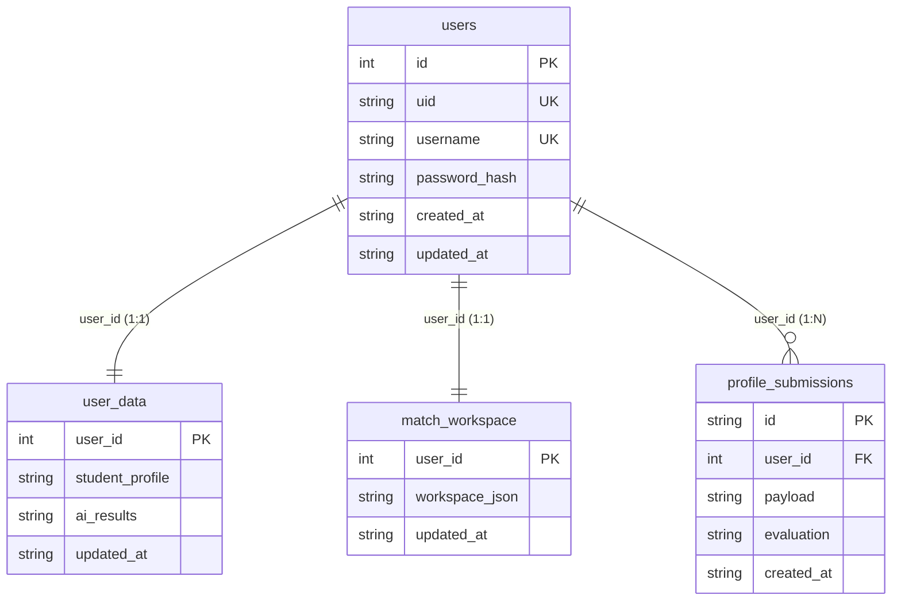

# 数据库与数据模型 (02_data_models.md)

本页面详细记录了本系统中所有核心的数据模型、模式结构（Schemas）以及规范化治理逻辑。涵盖标准岗位画像 JSON 结构与归一化规则、标签与领域资产中心（Tag Center & Domain Center）以及学生端（Career Planner）的 SQLite 关系数据库模式设计。

---

## 1. 标准岗位画像 JSON Schema

岗位画像是本系统进行标签统计、语义分析和人岗匹配最核心的通用接口。它被统一存放在标准岗位库文件 [career.json](file:///D:/1/CS&AI/个人项目/ALL/job_system - 交付版本/dataset/career.json) 中。一个完整的岗位画像 JSON 对象定义如下：

### 1.1 顶层字段列表
| 属性键 | 数据类型 | 说明 |
| :--- | :--- | :--- |
| `id` | `string` | 岗位 ID，全球唯一标识符，可手动输入或由 API 依据命名规范自动生成。 |
| `title` | `string` | 岗位官方公开名称，例如：`高级大模型研发工程师`。 |
| `companyName` | `string` | 雇主企业名称，例如：`字节跳动`。 |
| `direction` | `string` | 岗位技术方向，限制从固定方向列表（`taxonomy.py` 中的 `DIRECTION_OPTIONS`）中挑选。 |
| `industry` | `string` | 岗位所属行业，如：`人工智能`、`消费互联网`、`企业服务` 等。 |
| `metadata` | `object` | 岗位元数据属性字典。 |
| `jdSplit` | `object` | 原始 JD 文本切分后的句子级纯净事实。 |
| `basicRequirements` | `object` | 最低要求和硬性背景准入条件。 |
| `techStack` | `array` | 岗位强依赖的**技术栈**列表。包含“叶子”和“分支”两种节点结构。 |
| `techCapabilities` | `array` | 岗位要求具备的**抽象技术能力**列表。 |
| `devTools` | `array` | 软件工程中所需要的辅助开发与团队协作**工具/平台**。 |
| `softQuality` | `array` | 五个固定维度的**软素质**要求分值。 |
| `growthPotential` | `array` | 五个固定维度的**成长潜力**要求分值。 |
| `systemMeta` | `object` | 系统内部维护的只读元数据信息。 |

---

### 1.2 核心嵌套对象结构定义

#### 1.2.1 `metadata`
包含岗位的分类、薪资水平与部门氛围：
```json
{
  "jobType": "实习",
  "salaryRange": [4000.0, 6000.0],
  "departmentAtmosphere": "大牛云集，双休不加班"
}
```
* **`jobType`**：岗位类型。经过系统归一化后仅保留三种标准取值：`实习`、`校招全职`、`社招全职`。
* **`salaryRange`**：月薪资区间。固定格式为 `[min, max]` 双元素数组，单位固定为 `元/月`。若无法确定，则为 `null`。
* **`departmentAtmosphere`**：团队文化与氛围的文本描述。

#### 1.2.2 `jdSplit`
对原始文本的细粒度句子级事实切分：
```json
{
  "jobDescriptions": [
    "负责流式数据处理与分布式系统的日常迭代维护",
    "协助资深架构师完成分布式中间件的设计工作"
  ],
  "jobRequirements": [
    "熟练使用 Java 和 Go 语言，具备扎实的计算机功底",
    "熟悉 Kafka、RocketMQ 等消息队列机制"
  ],
  "bonusPoints": [
    "拥有高并发、大规模计算系统实战开发经验者优先"
  ],
  "notes": [
    "有开源项目贡献经历是加分项"
  ]
}
```

#### 1.2.3 `basicRequirements`
代表对候选人的背景红线要求：
```json
{
  "education_min": "本科",
  "major": ["计算机科学与技术", "软件工程", "信息安全"],
  "graduationYearRange": [2026, 2027],
  "certifications": [
    { "name": "CET-6", "level": 3, "note": "分数需达到 500 分以上" }
  ],
  "experiences": [
    "具备 1 年以上分布式系统实习或开发经验"
  ]
}
```
* **`education_min`**：最低学历，取值包括：`大专`、`本科`、`硕士`、`博士`，如果没有硬性要求则为 `null`。
* **`graduationYearRange`**：毕业年份范围双元素数组，如 `[2026, 2027]`，常用于校招/实习筛选。

#### 1.2.4 `techStack` (技术栈节点结构)
技术栈（`techStack`）指**具体的、可安装、可依赖、代码中可 import** 的 IT 软件或框架，而非抽象技能。支持两种节点结构：

* **叶子节点 (Leaf Node)**：表示**硬性必选**的某单项具体技术。
  ```json
  {
    "name": "Python",
    "rawExtractedText": "熟练掌握 Python 编程",
    "normalizedTag": "Python",
    "levelRequired": 3,
    "note": "主要用于大模型编排与数据清洗"
  }
  ```
* **分支节点 (Branch Node)**：表示“OR”多选一关系组，用来声明满足其中任意几项即可：
  ```json
  {
    "type": "branch",
    "groupName": "NoSQL数据库",
    "options": [
      { "name": "Redis", "levelRequired": 2 },
      { "name": "MongoDB", "levelRequired": 2 }
    ],
    "levelRequired": 2,
    "sum": 1,
    "note": "NoSQL 满足其一即可"
  }
  ```
  * `type`：固定为 `"branch"`。
  * `sum`：最低需满足的选项数量。默认值为 `1`。

#### 1.2.5 `techCapabilities` (抽象技术能力)
指**抽象的工程解决能力、设计模式、实战经验或底层理论**。例如系统架构设计、性能调优等。
```json
{
  "rawExtractedText": "具备高并发系统的性能优化经验",
  "normalizedTag": "Performance Optimization",
  "type": "engineering",
  "domain": "Backend Systems",
  "skill": "Performance Optimization",
  "skillZh": "性能优化",
  "levelRequired": 3
}
```
* **`type`**：能力类型。必须限制为以下四类之一：
  * `principle`：底层理论/算法原理（如：特征工程、NLP 理论）。
  * `engineering`：工程方法/设计能力（如：系统架构设计、微服务设计）。
  * `scene`：业务场景实战（如：高并发处理、海量数据存储）。
  * `soft_flag`：软性专业技术素养（如：代码规范度、技术文档编写）。
* **`domain`**：所属的技术领域。对应于 Domain Center 的标准类别。

#### 1.2.6 `devTools` (开发与协作工具)
软件生命周期中用于版本控制、项目管理、构建部署、辅助开发的实体工具（代码中无需 import）：
```json
{
  "rawExtractedText": "熟练使用 Git 控制版本",
  "normalizedTag": "Git",
  "skill": "Git",
  "skillZh": "Git",
  "levelRequired": 2
}
```

#### 1.2.7 `softQuality` 与 `growthPotential`
这二者是根据系统内置的分类维度固定补齐的数组（定义在 [taxonomy.py](file:///D:/1/CS&AI/个人项目/ALL/job_system - 交付版本/job-admin/backend/portrait_builder/taxonomy.py)）。要求等级范围为 `1~4`。
```json
"softQuality": [
  { "name": "沟通表达", "levelRequired": 2 },
  { "name": "团队协作", "levelRequired": 2 },
  { "name": "责任心", "levelRequired": 2 },
  { "name": "执行力", "levelRequired": 2 },
  { "name": "职业意识", "levelRequired": 2 }
],
"growthPotential": [
  { "name": "学习能力", "levelRequired": 2 },
  { "name": "创新能力", "levelRequired": 2 },
  { "name": "抗压能力", "levelRequired": 2 },
  { "name": "迁移能力", "levelRequired": 2 },
  { "name": "目标清晰度", "levelRequired": 2 }
]
```

---

### 1.3 画像规范化清洗规则 (`job_profile_schema.py`)

在 `job-admin/backend` 及 `career-planner/backend` 中，任何岗位画像数据的读写操作必须经过 [job_profile_schema.py](file:///D:/1/CS&AI/个人项目/ALL/job_system - 交付版本/job-admin/backend/job_profile_schema.py) 的 `normalize_job_profile()` 统一过滤：

1. **学历归一**：最低学历字段 `education_min` 若包含 “专科/大专” 统一归入 `大专`；包含 “本科/学士” 归入 `本科`；“硕士/研究生” 归入 `硕士`；“博士” 归入 `博士`。
2. **薪资范围标准化 (`normalize_salary_range`)**：
   * 支持字典 `{min, max}` 或列表 `[min, max]` 传参。将非数值、非正数或缺失一端的范围直接设为 `null`；保留的数值一律表示月薪薪资，单位统一为人民币元。
3. **技术栈去重与多选组过滤**：
   * 移除重复的叶子标签。
   * **硬性冗余过滤**：若岗位中同时存在一个单独的必选硬性要求叶子节点（如 `React`）和一个包含该标签的分支节点组（如 `React` OR `Vue` 框架组），`normalize_tech_stack` 算法会自动移除该冗余的分支节点组。
4. **算法类型自动晋升（Should Demote & Promote）**：
   * 若用户在 `techStack` 里填入的不是具体的实体框架或库，而是包含 “Algorithm” 或 “算法” 等字样的抽象术语，系统通过 `should_demote_tech_stack_item` 函数识别并利用 `promote_tech_stack_item_to_capability` 将其剥离，自动作为 `techCapabilities` 提升并写回。

---

## 2. 标签与领域资产中心 (Tag & Domain Center)

系统的词表数据资产维护在 `dataset/db/` 物理目录下。它为系统提供统一的英文 Normalized Tag 标准，并在前端搜索时作为标准库供检索。

### 2.1 标签中心数据结构 (Tag Center)
物理目录：[dataset/db/tag_center/](file:///D:/1/CS&AI/个人项目/ALL/job_system - 交付版本/dataset/db/tag_center/)

#### 2.1.1 `tag_master_normalized.json`
标签中心的主字典库，存储了全岗位库中收集到的所有经过归一对齐的标准技术词条：
```json
[
  {
    "tagId": "TS_E1199F64B34F",
    "tagType": "techStack",
    "canonicalName": "Spring Boot",
    "canonicalNameZh": "Spring Boot",
    "jobCount": 42,
    "jobRatio": 0.084,
    "isHighFrequency": true,
    "groupId": "TSG_9A12B1C2E"
  }
]
```
* **`tagId`**：前缀（`TS` - 技术栈, `TC` - 技术能力, `DT` - 工具） + 12位 SHA-1 哈希值。保证只要名称和类型不变，标签 ID 在全系统生命周期保持恒定。
* **`groupId`**：归属于某个多选分支 OR 分类组。

#### 2.1.2 `high_frequency_tags.json`
主字典字典的子集，只导出 `jobCount >= 10` (高频阈值) 的词条。

#### 2.1.3 `tag_translation_cache.json`
本地中英文翻译缓存，由 `tag_sync.py` 批处理任务调用大模型（Fast LLM）写入：
```json
{
  "a978f89...": {
    "tagType": "techStack",
    "normalizedTag": "Kubernetes",
    "nameZh": "容器编排引擎 Kubernetes",
    "updatedAt": "2026-06-07T02:00:00"
  }
}
```
* 键为 SHA-1 哈希值，计算公式为：`hash(tag_translation_prompt_version + tagType + normalizedTag)`。

#### 2.1.4 `tag_embedding_cache.jsonl`
存放标签对应的归一化 2048 维度向量数据，由向量模型接口一次性提取并追加：
```json
{"cacheKey": "react", "text": "React", "embedding": [0.012, -0.005, "..."], "profileId": "bigmodel_embedding_3", "provider": "bigmodel", "model": "embedding-3", "dimensions": 2048}
```

---

### 2.2 领域中心数据结构 (Domain Center)
物理目录：[dataset/db/domain_center/](file:///D:/1/CS&AI/个人项目/ALL/job_system - 交付版本/dataset/db/domain_center/)

#### 2.2.1 `domain_master.json`
```json
[
  {
    "domainId": "DM_52AA3871B20A",
    "domain": "Natural Language Processing",
    "name": "自然语言处理",
    "normalizedTag": "Natural Language Processing",
    "jobCount": 18,
    "mentionCount": 24,
    "tagCount": 7,
    "typeCounts": { "principle": 15, "engineering": 9 },
    "updatedAt": "2026-06-07T02:00:00"
  }
]
```

#### 2.2.2 `domain_tag_stats.json`
为前台提供领域深度分析图表的嵌套统计字典：
```json
[
  {
    "domainId": "DM_52AA3871B20A",
    "domain": "Natural Language Processing",
    "name": "自然语言处理",
    "jobCount": 18,
    "tags": [
      {
        "tagId": "TC_92B2B1B1C88E",
        "normalizedTag": "Transformer",
        "name": "Transformer架构",
        "jobCount": 12,
        "mentionCount": 15,
        "typeCounts": { "principle": 15 }
      }
    ]
  }
]
```

---

### 2.3 语义搜索索引结构 (`skill_search_index`)

在学生端，为了支持“专业技能自选输入”时的即时中文语义联想推荐（如输入 `高并发` 智能推荐出 `Concurrency Control`），后端会在启动时动态编译本地语义搜索索引。

* **元配置文件**：[skill_search_index_techCapabilities_v2.json](file:///D:/1/CS&AI/个人项目/ALL/job_system - 交付版本/dataset/db/tag_center/skill_search_index_techCapabilities_v2.json)
  存储索引版本、候选池数量以及对应的 Numpy 矩阵路径引用。
* **向量矩阵文件**：[skill_search_index_techCapabilities_v2.npy](file:///D:/1/CS&AI/个人项目/ALL/job_system - 交付版本/dataset/db/tag_center/skill_search_index_techCapabilities_v2.npy)
  无协议开销的 Numpy 扁平化数据文件，内部存放矩阵 `(candidateCount, 2048)` 的 float32 精度的归一化 Embedding 向量。

#### 联想搜索执行逻辑：
1. 学生在前台输入中文检索词，学生端后端调用 Embedding 接口将其转换为一维 query 向量。
2. 后端直接以只读内存映射方式（`mmap_mode="r"`）对 `.npy` 矩阵文件进行矩阵乘法（`np.dot`），瞬间计算出所有候选词的余弦相似度。
3. 提取相似度得分大于 `0.70` 的候选词条，结合 `jobCount` 热度权重进行混合排序，向前端输出最匹配的前 5 个标准 Tag 词条。

---

## 3. 学生端 SQLite 关系数据库模式

学生端的持久化关系数据（用户账户、个人画像、行动指南与匹配草稿）全部存放在 SQLite 中：
* **数据文件路径**：[career_planner.sqlite3](file:///D:/1/CS&AI/个人项目/ALL/job_system - 交付版本/dataset/career_planner/career_planner.sqlite3)
* **主驱动代码**：[storage.py](file:///D:/1/CS&AI/个人项目/ALL/job_system - 交付版本/career-planner/backend/storage.py)

### 3.1 关系模型表 Schema 定义



#### 3.1.1 用户表 (`users`)
保存用户的核心安全登录凭证：
```sql
CREATE TABLE IF NOT EXISTS users (
    id INTEGER PRIMARY KEY AUTOINCREMENT,
    uid TEXT UNIQUE,
    username TEXT NOT NULL UNIQUE,
    password_hash TEXT NOT NULL,
    created_at TEXT NOT NULL,
    updated_at TEXT NOT NULL
);
CREATE UNIQUE INDEX IF NOT EXISTS idx_users_uid ON users(uid);
```
* `uid`：为防主键自增泄露，对每个用户分配的内部公用 UID。格式示例：`U20260607020000000000_1a2b3c`。
* `password_hash`：使用 `bcrypt` 模块加密后的 Hash 串。

#### 3.1.2 用户画像与诊断状态表 (`user_data`)
存储用户当前的职业能力画像以及通过大模型（Flagship LLM）得出的画像诊断结果：
```sql
CREATE TABLE IF NOT EXISTS user_data (
    user_id INTEGER PRIMARY KEY,
    student_profile TEXT NOT NULL DEFAULT '{}',
    ai_results TEXT NOT NULL DEFAULT '{}',
    updated_at TEXT NOT NULL,
    FOREIGN KEY(user_id) REFERENCES users(id) ON DELETE CASCADE
);
```
* `student_profile`：JSON 文档。存放学生交互式编辑后的多维画像（包含 `techStack` 列表，`techCapabilities` 等字段）。
* `ai_results`：JSON 文档。存放画像诊断面板中展示的行动计划建议、能力漏洞诊断与学习路线图数据。

#### 3.1.3 简历画像历史提交记录表 (`profile_submissions`)
保留学生每次上传简历并经大模型解析结构化时的历史断点记录：
```sql
CREATE TABLE IF NOT EXISTS profile_submissions (
    id TEXT PRIMARY KEY,
    user_id INTEGER NOT NULL,
    payload TEXT NOT NULL,
    evaluation TEXT NOT NULL DEFAULT '{}',
    created_at TEXT NOT NULL,
    FOREIGN KEY(user_id) REFERENCES users(id) ON DELETE CASCADE
);
```
* `id`：以 `sub_` 开头的随机哈希字符。
* `payload`：当时解析出的 student_profile JSON 画像镜像。
* `evaluation`：当时生成的多维能力评估诊断报告 JSON 镜像。

#### 3.1.4 人岗匹配工作区草稿表 (`match_workspace`)
保存学生在“岗位智能发现”与“匹配沙盒”中的交互草稿状态，防止页面刷新丢失：
```sql
CREATE TABLE IF NOT EXISTS match_workspace (
    user_id INTEGER PRIMARY KEY,
    workspace_json TEXT NOT NULL DEFAULT '{}',
    updated_at TEXT NOT NULL,
    FOREIGN KEY(user_id) REFERENCES users(id) ON DELETE CASCADE
);
```
* `workspace_json`：核心 JSON 数据块。由于匹配工作区具备极其多变且频繁的临时状态（如学生勾选对比的岗位 ID 列表、暂存的打分权重、星标收藏岗位卡片、当前的推荐岗位列表等），系统不对其设计硬性表，而是将其打包成一个高内聚的 JSON 树进行存储。其内部子字段包括：
  * **`currentBasket`**：学生正在“岗位对比篮子”中放置的对比岗位 ID 数组及局部打分微调比例。
  * **`basketHistory`**：包含多次对比报告的诊断快照。
  * **`harvests`**：已收藏岗位的完整画像数据，打上 `"workspaceStatus": "harvested"` 标识。
  * **`actionPlan`**：基于当前匹配推荐列表定制的用户自选“每日学习时间计划书”。
  * **`searchHistory`**：客户端传递过来的前端检索条件（按城市、方向、工作类型过滤）历史。

---

## 4. 当前交付实现与注意事项

本节记录按当前代码和交付目录核对出的实际存储约定，供后续维护时优先参考。

### 4.1 关键本地文件与运行时目录

| 路径 | 用途 |
| --- | --- |
| `dataset/career.json` | 管理端岗位库主数据。当前交付目录是 5 条示例岗位。 |
| `dataset/db/tag_center/` | Tag Center 主表、高频标签、embedding/query cache、归一 run、tag review run。 |
| `dataset/db/domain_center/` | Domain Center 主表、领域统计。 |
| `dataset/runtime_data/portrait_builder_data/uploads/{upload_id}/` | Builder 上传记录，包含 `records.json`、`summary.json`。 |
| `dataset/runtime_data/portrait_builder_data/runs/{run_id}/` | Builder 运行记录，包含 `manifest.json`、`progress.json`、`results.jsonl`、`failures.jsonl`、`logs.jsonl`、`embedding_logs.jsonl`、`portraits.json`、`import_summary.json`、`apply_history.jsonl`、`apply_progress.json`。 |
| `dataset/runtime_data/portrait_builder_data/db/` | Builder 运行索引与事件流，如 `runs_index.json`、`run_events.jsonl`。 |
| `dataset/runtime_data/portrait_builder_data/snapshots/` | Builder apply 前的岗位库和标签快照。 |
| `dataset/db/tag_center/normalization_runs/{run_id}/` | 全量归一化任务的 manifest/progress/result/logs。 |
| `dataset/db/tag_center/tag_review_runs/{run_id}/` | 标签复查任务的 manifest/progress/result/logs/request/candidates/checkpoint/control。 |
| `dataset/career_planner/career_planner.sqlite3` | 学生端 SQLite 主库。 |
| `dataset/career_planner/skill_search_query_embedding_cache_*.jsonl` | 学生端中文查询 embedding cache。 |
| `dataset/exports/` | 管理端导出的默认目录。 |

### 4.2 Tag 与 Domain 资产字段

| 资产 | 主要字段 |
| --- | --- |
| Tag Master | `tagId`, `canonicalName`, `canonicalNameZh`, `tagType`, `jobCount`, `jobRatio`, `isHighFrequency`, `groupId`, `typeCounts`, `type` |
| Domain Master | `domainId`, `domain`, `name`, `normalizedTag`, `jobCount`, `mentionCount`, `tagCount`, `typeCounts`, `updatedAt` |

常见 ID 前缀：

| 前缀 | 含义 |
| --- | --- |
| `TS` | 技术栈 |
| `TC` | 技术能力 |
| `DT` | 开发工具 |
| `SQ` | 软素质 |
| `GP` | 成长潜力 |
| `DM` | Domain |
| `TSG` | 技术栈分支组 |

### 4.3 核心读写函数

| 模块 | 关键函数 |
| --- | --- |
| `job-admin/backend/project_paths.py` | `load_root_env_file()`, `resolve_job_library_file()`, `materialize_job_library_file()`, `ensure_runtime_dirs()` |
| `job-admin/backend/job_profile_schema.py` | `normalize_job_profile()`, `normalize_job_library()`, `normalize_job_type()`, `normalize_tech_stack()`, `normalize_tech_capabilities()`, `normalize_dev_tools()` |
| `job-admin/backend/backend_app/job_data_service.py` | `load_jobs_from_disk()`, `save_jobs_to_disk()`, `rebuild_job_runtime()`, `initialize_runtime()`, `ensure_jobs_fresh()`, `persist_and_refresh_jobs()`, `create_job_record()`, `update_job_record()`, `delete_job_record()`, `load_tag_master_rows()` |
| `job-admin/backend/tag_sync.py` | `load_jobs()`, `save_jobs()`, `rebuild_tag_assets()`, `normalize_existing_job_library_strict()`, `read_embedding_cache_rows()`, `write_embedding_cache_rows()`, `load_embedding_cache()`, `append_embedding_cache_rows()`, `rebuild_domain_assets()` |
| `job-admin/backend/portrait_builder/api_storage.py` | `write_json()`, `read_json()`, `append_jsonl()`, `read_jsonl()`, `load_run_index()`, `save_run_index()`, `create_apply_snapshot()`, `restore_apply_snapshot()` |
| `job-admin/backend/backend_app/normalization_service.py` | `start_normalization_run()`, `get_normalization_run_snapshot()`, `load_run_index()` |
| `job-admin/backend/backend_app/tag_review_service.py` | `load_review_stats()`, `save_review_stats()`, `save_run_request()`, `save_run_candidates()`, `save_run_checkpoint()`, `write_run_control_action()` |
| `career-planner/backend/storage.py` | `init_db()`, `create_user()`, `get_user_data()`, `upsert_user_data()`, `insert_profile_submission()`, `get_match_workspace()`, `upsert_match_workspace()`, `reset_user_data()` |
| `career-planner/backend/tech_capability.py` | `load_tag_center_rows()`, `search_professional_skills()`, `recommend_professional_skills()`, `load_domain_center_rows()`, `recommend_tech_domains()`, `search_tech_domains()`, `resolve_tag_center_catalog()` |

### 4.4 已知数据与文档差异

| 项 | 当前实现事实 |
| --- | --- |
| `JOB_SYSTEM_JOB_LIBRARY_PATH` | `project_paths.py` 能解析该变量，但部分主读写实现仍直接使用 `dataset/career.json`，自定义岗位库路径未完全贯通。 |
| Tag Center 文件名 | 部分文档写 `tag_master_normalized.json`、`high_frequency_tags_normalized.json` 等；当前交付目录实际有 `tag_master.json`、`high_frequency_tags.json` 等兼容资产。 |
| 全量资产与示例库口径 | 当前交付目录的 `career.json` 是示例库，但 `tag_center`、`domain_center` 的部分统计可能来自 10000+ 全量库。启动管理端重建资产时需确认是否会覆盖。 |
| Embedding cache | 文档提到 `tag_embedding_cache.jsonl`；当前代码配置与目录中可能使用其他 cache 文件名，需以运行时配置为准。 |
| Domain 统计 | 当前目录可能缺少 `domain_tag_stats.json`、`domain_translation_cache.json`；`summary.json` 里的源路径可能仍指向旧机器。 |
| 匹配接口分析字段 | `POST /api/match` 当前 `analysis` 多为空，深度报告拆到 `/api/match/insight` 或 harvest 流程。 |
| 岗位 ID 形态 | 示例数据使用 `JOB_run_..._00001` 形态，手动新建岗位仍可能生成 `Job_数字`，后续存在混用。 |
| 学生画像技术能力字段 | 主 schema 与匹配服务使用 `techCapabilities`；部分保存/快照逻辑仍读取 `techCapability` 单数字段，计数可能偏低。 |
