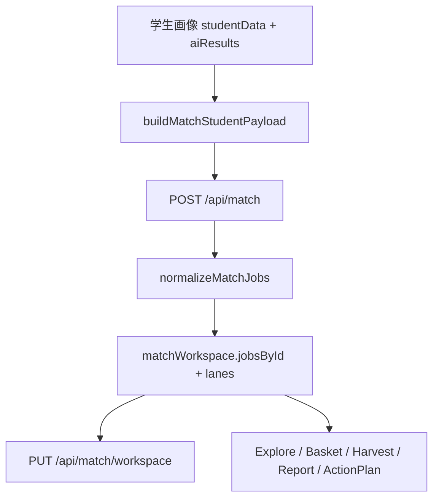

# 前端页面功能与交互设计

本页记录 `job-admin` 与 `career-planner` 两套 React 前端，以及仍保留在交付包中的 `job-admin/frontend/legacy` 页面。重点说明页面路由、组件层级、用户可执行操作、真实 API 调用和当前占位/模拟能力。

---

## 1. Job Admin React 前端

入口文件：`job-admin/frontend/src/App.jsx`

整体结构分两类：

- 管理后台常规页面：`Sidebar` + `Topbar` + 页面内容。
- 匹配工作区页面：`/match/*` 使用全屏布局，不显示常规后台边栏。

### 1.1 路由与页面组件

| 路由 | 页面组件 | 布局 | 说明 |
| --- | --- | --- | --- |
| `/` | `Dashboard` | 管理后台布局 | 指标看板与模块入口 |
| `/jobs` | `JobMatrix` | 管理后台布局 | 岗位库查询与 CRUD |
| `/ingest` | `Ingestion` | 管理后台布局 | 上传岗位源数据并创建 Builder run |
| `/tags` | `TagsCenter` | 管理后台布局 | 标签中心检索与统计 |
| `/runs` | `RunLogs` | 管理后台布局 | Builder run 列表概览 |
| `/settings` | `Settings` | 管理后台布局 | 模型配置与连通性测试 |
| `/normalize` | `Normalization` | 管理后台布局 | 标签归一化与 tag-review 任务入口 |
| `/match` | redirect `/match/explore` | 全屏匹配工作区 | 智能匹配入口 |
| `/match/:section` | `MatchPage` | 全屏匹配工作区 | `explore/basket/harvest/action/profile` 等工作区分区 |
| `/match_` | `BasicMatchPage` | 全屏匹配工作区 | 旧式 JSON 匹配入口 |
| `/matchh` | `BasicMatchPage` | 全屏匹配工作区 | 旧式 JSON 匹配入口别名 |

### 1.2 页面功能与 API

| 页面 | 用户操作 | 真实 API |
| --- | --- | --- |
| `Dashboard` | 查看岗位数、标签数、运行任务等总览；点击进入模块 | `GET /api/admin/summary` |
| `JobMatrix` | 条件筛选、分页、最近岗位、JSON 编辑、新建、更新、删除岗位 | `GET /api/metadata`, `GET /api/admin/summary`, `GET /api/jobs?...`, `POST /api/admin/jobs`, `PUT /api/admin/jobs/{id}`, `DELETE /api/admin/jobs/{id}` |
| `Ingestion` | 上传 raw/structured 文件；base64 提交；预检模型配置；创建 Builder run；可设置 retry/autoApply 参数 | `POST /api/builder/uploads`, `POST /api/builder/configs/preflight`, `POST /api/builder/runs` |
| `TagsCenter` | 搜索标签、按类型/占比/view 过滤 | `GET /api/admin/summary`, `GET /api/admin/tags?q=&tag_type=&min_ratio=&view=&limit=` |
| `RunLogs` | 查看 run 列表和概览；约 30 秒自动刷新 | `GET /api/admin/summary`, `GET /api/builder/runs` |
| `Settings` | 本地维护模型配置；测试某个配置是否可用 | `POST /api/builder/configs/test` |
| `Normalization` | 启动归一化任务；启动 tag-review；查看任务列表概要 | `GET /api/admin/normalization/runs`, `POST /api/admin/normalization/runs`, `GET /api/admin/normalization/tag-review/runs?review_mode=all`, `POST /api/admin/normalization/tag-review/runs` |
| `BasicMatchPage` | 手动输入学生画像 JSON；调用匹配；查看结果和历史 | `POST /api/match` |
| `MatchPage` | 推荐探索、加入篮子、收割、行动计划、画像事件模拟、详情抽屉 | `POST /api/match`, 后台异步 `POST /api/match/insight` |

`MatchPage` 中这些 endpoint 在页面领域模型里被列为 reserved/占位或模拟逻辑，React 管理端当前未完整接入：

| Endpoint | 当前状态 |
| --- | --- |
| `POST /api/match/check` | 后端存在，管理端 React 工作区部分场景仍偏模拟/预留 |
| `PUT /api/match/basket/active` | 后端不存在 |
| `POST /api/match/basket/submit` | 学生端存在；Job Admin 后端不存在同名路由 |
| `GET /api/match/harvest/{basketId}` | 学生端存在；Job Admin 后端不存在同名 GET |
| `POST /api/match/action-plan` | 学生端存在；Job Admin 后端不存在同名路由 |
| `POST /api/match/profile/sync-event` | 后端不存在 |

### 1.3 共享状态与工具

| 模块 | 职责 |
| --- | --- |
| `hooks/useApi.js` | `fetchJson(url, options)`；自动解析 JSON/text；将错误存入 hook state |
| `context/ThemeContext.jsx` | 管理 `ujs_theme`，同步 `document.documentElement.dataset.theme` |
| `context/ToastContext.jsx` | 统一 toast 栈 |
| `pages/matchWorkspace.js` | 匹配工作区领域工具：推荐分组、岗位结果归一、分数工具、篮子/收割/行动计划/画像事件模拟 |
| localStorage | `portrait_builder_configs_v1`, `match_history_react_v1`, `match_input_react_v1`, `match_history_orchard_v2`, `match_input_orchard_v2`, `match_workspace_orchard_v3` |

---

## 2. Job Admin Legacy 前端

目录：`job-admin/frontend/legacy`

legacy 页面仍在交付包中，且部分运维能力比 React 新版更完整。它们由独立 HTML、`legacy/assets/admin-common.js` 和 `legacy/assets/pages/*.js` 组成。

### 2.1 页面清单

| 页面 | 主要功能 | 与 React 版关系 |
| --- | --- | --- |
| `index.html` | Dashboard | 与 React `Dashboard` 重叠 |
| `jobs.html` | 岗位矩阵、岗位详情、CRUD | 与 React `JobMatrix` 重叠，额外直接打开完整详情 |
| `ingest.html` | Builder 上传、创建 run、轮询、暂停、恢复、写回、撤销、删除、写回进度 | 比 React `Ingestion` 更完整 |
| `runs.html` | run 列表、详情、暂停/恢复/删除、apply/revoke、retry、替换配置、熔断恢复、artifact 下载 | 比 React `RunLogs` 更完整 |
| `settings.html` | 模型配置、模型发现、配置测试 | 比 React `Settings` 多 `POST /api/builder/models` |
| `tags.html` | 标签中心 | 与 React `TagsCenter` 重叠 |
| `normalize.html` | 归一任务和 tag-review 详情控制台、日志、结果、暂停/恢复/重启 | 比 React `Normalization` 更完整 |
| `match.html` | 独立 `/api/match` 调试页 | 与 `BasicMatchPage` 类似但状态独立 |
| `debug.html` | 详细打分调试器 | React 版没有对应页 |
| `builder.html` | 跳转到 `ingest.html` | 历史兼容入口 |

### 2.2 Legacy 额外 API 能力

| 页面 | 额外接口 |
| --- | --- |
| `ingest.html` | `/api/builder/runs/{id}/pause`, `/resume`, `/apply`, `/revoke`, `DELETE /api/builder/runs/{id}`, `/apply-progress` |
| `runs.html` | `/api/builder/runs/{id}`, `/retry`, `/configs/replace`, `/configs/recover-circuit`, `/artifacts/{artifact}` |
| `settings.html` | `POST /api/builder/models` |
| `normalize.html` | 归一 run 详情轮询；tag-review 详情、暂停、恢复、重启 |
| `debug.html` | `POST /api/debug/score` |
| `match.html` | `POST /api/match`，localStorage 历史 `match_history_bluewhite_strict_v1` |

### 2.3 交付提醒

如果验收目标包含完整 Builder 运维、run 产物下载、配置替换、熔断恢复或 tag-review 详情控制台，应优先确认 legacy 页面是否仍作为正式入口交付；React 新版目前更像轻量化后台外壳。

---

## 3. Career Planner React 前端

入口文件：`career-planner/frontend/src/App.jsx`

所有业务页都受 `ProtectedRoute` 保护；登录后常规页面使用 `MainLayout`，沉浸式岗位发现页面使用全屏无布局模式。

### 3.1 路由与页面组件

| 路由 | 页面组件 | 结构 | 说明 |
| --- | --- | --- | --- |
| `/login` | `Login` | 公共页面 | 登录/注册 |
| `/` | `Profile` | `ProtectedRoute` + `MainLayout` | 学生画像主工作台 |
| `/matching/*` | `Matching` | `MainLayout` | 匹配模块父路由 |
| `/matching/explore` | `ExploreView` | `MatchingLayout` | 推荐探索 |
| `/matching/basket` | `BasketView` | `MatchingLayout` | 当前岗位篮子 |
| `/matching/harvest` | `HarvestView` | `MatchingLayout` | 收割报告与历史 |
| `/matching/profile` | `ProfileMatchView` | `MatchingLayout` | 匹配画像快照 |
| `/matching/immersive` | `ImmersiveDiscovery` | 受保护、无 `MainLayout` | 全屏岗位浏览 |
| `/ai-eval` | `AiEval` | `MainLayout` | AI 画像评估 |
| `/report` | `Report` | `MainLayout` | 收藏报告与报告问答 |
| `/action-plan` | `ActionPlan` | `MainLayout` | 行动计划与打卡 |
| `/settings` | `Settings` | `MainLayout` | 账号、重置、退出 |

### 3.2 页面功能与 API

| 页面 | 用户操作 | API |
| --- | --- | --- |
| `Login` | 登录、注册、保存 token/user | `POST /api/auth/login`, `POST /api/auth/register`, 初始化时 `GET /api/auth/me` |
| `Profile` | 编辑基础信息、方向、偏好、经历、技能；上传简历解析；提交画像；触发推荐 | `POST /api/ai/resume/parse`, `GET /api/student-profile/tech-domains/recommendations`, `GET /api/student-profile/tech-domains/search`, `GET /api/student-profile/professional-skills/search`, `GET /api/student-profile/professional-skills/recommendations`, `POST /api/ai/profile/soft-quality`, `POST /api/ai/profile/growth-potential`, `POST /api/student-profile/submit-and-evaluate`, `POST /api/match` |
| `AiEval` | 完整度评估、技能核查、等级推断、应用 AI 建议 | `POST /api/ai/profile/completeness`, `POST /api/ai/profile/skillcheck`, `POST /api/ai/profile/infer-levels`, 辅助调用 `GET /api/student-profile/professional-skills/search` |
| `ExploreView` | 自动/手动生成推荐、翻页、查看岗位详情、准入核查、加入篮子、进入沉浸模式 | `POST /api/match`, `POST /api/match/check`, `PUT /api/match/workspace`, 详情抽屉调用 `GET /api/student-profile/tag-center/resolve` |
| `BasketView` | 查看当前篮子、核查岗位、移除岗位、提交收割 | `POST /api/match/check`, `POST /api/match/basket/submit`, `PUT /api/match/workspace` |
| `HarvestView` | 查看排名、完整报告、收藏报告、设为目标、删除 harvest | `DELETE /api/match/harvest/{id}`, `PUT /api/match/workspace` |
| `ImmersiveDiscovery` | 全屏岗位浏览，键盘左右切换，查看详情、核查、入篮 | 同 Explore/Basket 的 match/check/workspace |
| `ProfileMatchView` | 查看匹配用画像快照和画像事件 | 主要读取 `DataContext` |
| `Report` | 查看收藏报告、删除、导出 Markdown、向报告聊天提问 | `POST /api/reports/chat`，报告收藏状态保存在 workspace |
| `ActionPlan` | 选择目标岗位、生成短板任务、勾选子任务、打卡、实习推荐 | `POST /api/match/internship-recommendations`, `PUT /api/match/workspace` |
| `Settings` | 退出登录、重置全部数据、重新显示 onboarding | `POST /api/user-data/reset` |

`Settings` 中用户名/密码修改 API 在后端存在：`PUT /api/auth/username`、`PUT /api/auth/password`。当前页面实现偏展示/辅助操作，wiki 不把它写成已完整接线的账号修改流程。

### 3.3 学生端共享状态

| 模块 | 职责 |
| --- | --- |
| `services/api.js` | axios 实例；`baseURL = VITE_API_BASE_URL || ''`；自动注入 Bearer；响应直接返回 `response.data` |
| `AuthContext.jsx` | 登录态、登录、注册、退出；localStorage key 为 `cp_auth_token`, `cp_auth_user` |
| `DataContext.jsx` | 全局业务状态：`studentData`, `aiResults`, `matchWorkspace`, `loading`, `syncing`, `matching`, `profileAiTasks`, `isProfileDirty`, `showOnboarding`, `ripeningStatus` |
| `utils/profileData.js` | 学生画像归一、AI 结果归一、构造匹配 payload |
| `utils/skillcheck.js` | AI skillcheck 结果归一、搜索补全、应用增删改建议 |
| `services/matchWorkspace.js` | 推荐 lanes 归一、分数工具、岗位详情标签解释、篮子/收割/行动计划/画像快照工具 |
| `services/careerReports.js` | 报告快照、收藏/删除、Markdown 导出 |

`DataContext` 初始化时并发拉取：

```text
GET /api/student-profile/me
GET /api/match/workspace
```

随后把服务端数据与本地草稿合并。本地草稿 key：

```text
cp_draft_{userId}_studentData
cp_draft_{userId}_aiResults
cp_draft_{userId}_matchWorkspace
```

AI 评估任务还会使用类似：

```text
cp_ai_eval_{kind}_{userKey}_{taskType}
```

### 3.4 Match Workspace 数据流



工作区主要字段：

| 字段 | 说明 |
| --- | --- |
| `jobsById` | 推荐或收割过的岗位快照字典 |
| `lanes` | `featured`, `featured_safety`, `featured_target`, `featured_reach`, `interest`, `switch` |
| `currentBasket` | 当前唯一活跃篮子 |
| `basketHistory` | 历史篮子提交记录 |
| `harvests` | 收割报告记录 |
| `savedReports` | 收藏报告 |
| `actionPlan` | 行动计划和打卡状态 |
| `profileEvents` | 前端画像事件 |
| `selectedHarvestId`, `targetJobId`, `selectedReportJobId` | 当前选择状态 |

---

## 4. 重复实现与验收风险

| 风险点 | 说明 |
| --- | --- |
| 管理端 React 与 legacy 并存 | React 版更现代，但 legacy 仍承载完整 Builder 运维和 debug 功能。 |
| 多个匹配入口 | `MatchPage`、`BasicMatchPage`、legacy `match.html` 都调用或模拟 `/api/match`，状态 key 和展示方式不同。 |
| reserved endpoint 混入前端领域模型 | `pages/matchWorkspace.js` 中列了一些后端不存在或学生端独有的 endpoint，文档和联调时必须区分。 |
| 错误格式读取不完全 | 后端返回 `{error.message}`，学生端 axios 拦截器当前未显式读取该字段，可能显示默认错误。 |
| React 版 Normalization/RunLogs 功能轻 | 暂停、恢复、retry、artifact 下载、熔断恢复等能力主要还在 legacy。 |
| `/api/debug/score` 无 React 页 | 详细匹配打分调试目前只有 legacy `debug.html`。 |

---

## 5. 页面到接口快速映射

### 5.1 管理端

```text
Dashboard      -> /api/admin/summary
JobMatrix      -> /api/metadata, /api/jobs, /api/admin/jobs*
Ingestion      -> /api/builder/uploads, /api/builder/configs/preflight, /api/builder/runs
TagsCenter     -> /api/admin/summary, /api/admin/tags
RunLogs        -> /api/admin/summary, /api/builder/runs
Settings       -> /api/builder/configs/test
Normalization  -> /api/admin/normalization/*
MatchPage      -> /api/match, /api/match/insight
BasicMatchPage -> /api/match
legacy debug   -> /api/debug/score
```

### 5.2 学生端

```text
Login          -> /api/auth/login, /api/auth/register, /api/auth/me
Profile        -> /api/user-data, /api/ai/resume/parse, /api/student-profile/*, /api/match
AiEval         -> /api/ai/profile/*
Matching       -> /api/match, /api/match/check, /api/match/workspace
Basket         -> /api/match/basket/submit
Harvest        -> /api/match/harvest/{id}, /api/match/workspace
Report         -> /api/reports/chat
ActionPlan     -> /api/match/internship-recommendations, /api/match/workspace
Settings       -> /api/user-data/reset
```
